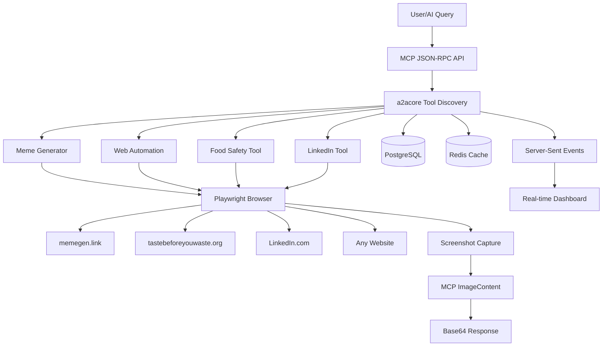

# a2aWebAgent: MCP Web Automation Demo

This project serves as:
- **MCP Protocol Implementation** - Educational example of Model Context Protocol integration
- **Web Automation Tools** - Practical browser automation with Playwright
- **Multi-Tool Demo** - Food safety, LinkedIn search, simple meme generation, and general web browsing
- **Real-time Processing** - Async task execution with progress tracking 

[](https://openjdk.java.net/projects/jdk/18/)
[](https://spring.io/projects/spring-boot)
[](https://github.com/vishalmysore/a2ajava)
[](https://modelcontextprotocol.io/)
[](https://docs.docker.com/compose/)
[](https://opensource.org/licenses/MIT)

> **Educational MCP implementation with practical web automation tools.**

Demonstrates natural language to web automation using the Model Context Protocol, including basic browser automation, screenshot capture, and simple tool integration.

## 🚀 Example Usage

**Simple Meme Generation** (HelloWorld replacement):
```bash
curl -X POST http://localhost:7860 \
  -d '{"jsonrpc":"2.0","method":"tools/call","params":{"name":"generateMeme","arguments":{"template":"drake","topText":"Regular responses","bottomText":"Meme responses"}},"id":1}'
```

**Other Available Tools**:
- 🍽️ **Food Safety Lookup**: Basic tastebeforeyouwaste.org integration
- 💼 **LinkedIn Demo**: Simple profile search example
- 🌐 **Web Automation**: General browsing with screenshot capture
- ⚡ **Async Processing**: Background task execution

**Response Time**: ~1-3 seconds for most operations

## 🌟 Key Features

### 🛠️ **Web Automation Tools**
- **Simple Meme Generation**: Basic memegen.link integration as HelloWorld demo
- **Screenshot Capture**: Browser automation for visual documentation
- **Natural Language Interface**: Describe automation tasks in plain English
- **Multi-Provider Support**: Works with OpenAI, Google Gemini, and Anthropic Claude
- **Basic Web Interaction**: Navigate, click, type, and capture content

### 🔄 **Real-Time Processing**
- **Fast Response**: Quick tool execution for basic automation
- **Async Task Management**: Non-blocking execution with progress updates
- **Server-Sent Events**: Real-time status updates
- **ImageContent Support**: MCP image handling with base64 encoding

### 🌐 **Advanced Web Automation**
- **Microsoft Playwright 1.51.0**: Next-generation browser automation with headless Chrome
- **Screenshot Intelligence**: Automated visual documentation of results
- **Dynamic Content Handling**: Adaptive automation for modern web applications
- **Production Ready**: Playwright-based architecture with comprehensive test coverage

### 📊 **Technical Architecture**
- **a2acore Framework**: Simple MCP framework for tool discovery
- **Database Support**: PostgreSQL + Redis for basic persistence
- **Docker Deployment**: Containerized setup with browser dependencies
- **Health Monitoring**: Basic health checks and status endpoints

### 🔌 **Protocol Implementation**
- **MCP (Model Context Protocol)**: Basic Anthropic standard implementation
- **JSON-RPC 2.0**: Standard communication protocol
- **Tool Discovery**: Simple @Action method registration
- **Parameter Validation**: Basic input validation

## 📋 Table of Contents

- [Quick Start](#-quick-start)
- [Architecture Overview](#-architecture-overview)
- [A2A Protocol Integration](#-a2a-agent-to-agent-protocol)
- [MCP Protocol Integration](#-mcp-model-context-protocol)
- [Neo4j Knowledge Graphs](#-neo4j-knowledge-graphs)
- [API Documentation](#-api-documentation)
- [Development Setup](#-development-setup)
- [Docker Deployment](#-docker-deployment)
- [Testing](#-testing)
- [Performance](#-performance)
- [Troubleshooting](#-troubleshooting)
- [Contributing](#-contributing)

## 🚀 Quick Start

### Prerequisites
- Java 18+
- Maven 3.1+
- Docker & Docker Compose
- OpenRouter API key (recommended) or other AI provider credentials

### 1. Clone and Setup
```bash
git clone <repository-url>
cd a2aTravelAgent/a2awebagent
```

### 2. Configure AI Provider

#### Option A: OpenRouter (Recommended)
```bash
# Get your API key from https://openrouter.ai/
# Copy the template configuration
cp src/main/resources/tools4ai.properties.template src/main/resources/tools4ai.properties

# Edit the configuration file and add your OpenRouter API key
# Replace YOUR_OPENROUTER_API_KEY_HERE with your actual key
```

#### Option B: Alternative Providers
```bash
# For Google Gemini (requires Google Cloud setup)
gcloud auth application-default login
cp ~/.config/gcloud/application_default_credentials.json ./

# For OpenAI or Anthropic Claude
# Set your API keys in tools4ai.properties
```

### 3. Run with Docker
```bash
# Start all services
docker-compose up -d

# View logs
docker-compose logs -f a2awebagent
```

### 4. Access the Application
- **Main Application**: http://localhost:7860
- **Dashboard**: http://localhost:7860/agents
- **Health Check**: http://localhost:7860/actuator/health
- **Database Admin**: http://localhost:8080 (pgAdmin)
- **Redis Monitor**: http://localhost:8081 (Redis Commander)
- **Neo4j Browser**: http://localhost:7474

### 5. Test with Example Queries

#### Basic Meme Generation
```bash
curl -X POST http://localhost:7860 \
  -H "Content-Type: application/json" \
  -d '{
    "jsonrpc": "2.0",
    "method": "tools/call",
    "params": {
      "name": "generateMeme",
      "arguments": {
        "template": "drake",
        "topText": "Hello World", 
        "bottomText": "Hello Meme"
      }
    },
    "id": 1
  }'
```

#### Food Safety Query
```bash
curl -X POST http://localhost:7860 \
  -H "Content-Type: application/json" \
  -d '{
    "jsonrpc": "2.0",
    "method": "tools/call",
    "params": {
      "name": "askTasteBeforeYouWaste",
      "arguments": {
        "foodQuestion": "Is week-old milk still safe to drink?"
      }
    },
    "id": 2
  }'
```

#### General Web Automation
```bash
curl -X POST http://localhost:7860 \
  -H "Content-Type: application/json" \
  -d '{
    "jsonrpc": "2.0",
    "method": "tools/call",
    "params": {
      "name": "browseWebAndReturnText",
      "arguments": {
        "webBrowsingSteps": "Navigate to google.com and search for ai memes"
      }
    },
    "id": 3
  }'
```

## 🛠️ Current Tools Available

| Tool Name | Description | Input | Output |
|-----------|-------------|--------|--------|
| `generateMeme` | Simple meme generation demo (HelloWorld replacement) | Template, top text, bottom text | Screenshot of generated meme |
| `browseWebAndReturnText` | Basic web automation with text extraction | Natural language browsing instructions | Extracted text content |
| `browseWebAndReturnImage` | Web automation with screenshot capture | Natural language browsing instructions | Base64 encoded screenshot |
| `askTasteBeforeYouWaste` | Food safety information lookup | Food safety question | Safety guidance from tastebeforeyouwaste.org |
| `getTasteBeforeYouWasteScreenshot` | Screenshot of food safety website | None | Visual food safety guide |
| `searchLinkedInProfile` | LinkedIn profile search demo | Name or professional details | Profile information with screenshots |
| `getWingstonsProjectsExpertiseResume` | Technical portfolio example | None | Project showcase |

## 🛠️ Simple Meme Generation (HelloWorld Demo)

### Basic Implementation
Replaces traditional "Hello World" with a simple meme generator that demonstrates MCP ImageContent handling.

### How It Works
1. **URL Building**: Creates memegen.link URL with text parameters
2. **Browser Navigation**: Uses Playwright to visit the meme URL
3. **Screenshot**: Captures the rendered meme as PNG
4. **MCP Response**: Returns as ImageContent with base64 encoding

### Available Templates
Basic meme templates from memegen.link:
- `drake` - Choice preferences
- `distracted-boyfriend` - Dilemma scenarios  
- `woman-yelling-at-cat` - Arguments
- `this-is-fine` - Acceptance of chaos
- `expanding-brain` - Levels of understanding
- Plus others available from [memegen.link](https://memegen.link/templates)

### Example Usage
```json
{
  "template": "drake",
  "topText": "Hello World",
  "bottomText": "Hello Meme"
}
```
Simple demonstration of browser automation and image capture.

## 🏗️ Architecture Overview

### System Components



### Technology Stack

#### **Backend Infrastructure**
- **Spring Boot 3.2.4**: Enterprise application framework with reactive support
- **Java 18**: Modern JDK with enhanced performance and language features
- **Maven**: Dependency management and build automation
- **Lombok**: Automatic code generation for cleaner POJOs

#### **AI Integration Layer**
- **a2acore Framework**: Lightweight MCP framework with fast startup and tool auto-discovery
- **tools4ai 1.1.6.2**: AI tool integration framework with annotation-based configuration
- **Multi-Provider Support**: OpenRouter (recommended), OpenAI GPT-4o-mini, Google Gemini 2.0, Anthropic Claude-3
- **ImageContent Protocol**: Advanced MCP image handling for meme generation and screenshots

#### **Web Automation Engine**
- **Microsoft Playwright 1.51.0**: Next-generation browser automation with Chrome DevTools Protocol
- **Spring Playwright Integration**: Seamless Spring Boot configuration and lifecycle management
- **Screenshot Engine**: Automated visual documentation with metadata
- **Docker Optimized**: Ready-to-run containerized deployment with pre-installed browser dependencies

#### **Data Persistence**
- **PostgreSQL 15**: ACID-compliant relational database for task management and tool caching
- **Redis 7**: High-performance caching and real-time message passing
- **Neo4j 5**: Graph database for knowledge representation (travel, professional networks)
- **H2**: In-memory database for testing and development
- **File System**: Screenshot storage with content-based naming and absolute path management

#### **Real-time Communication**
- **Server-Sent Events (SSE)**: Live progress updates to web dashboard
- **WebSocket**: Bidirectional real-time communication
- **Spring WebSocket**: Reactive messaging framework with STOMP protocol

## 🤝 A2A (Agent-to-Agent) Protocol

### Overview
The Agent-to-Agent (A2A) protocol, developed by Google, enables seamless communication between AI agents without requiring shared memory, tools, or context. Our implementation demonstrates enterprise-grade A2A integration patterns.

### Key Benefits
- **Interoperability**: Agents can collaborate regardless of their implementation technology
- **Scalability**: Distributed architecture supports horizontal scaling
- **Security**: Built-in authentication and authorization mechanisms
- **Standards Compliance**: Follows Google's A2A specification

### Implementation Architecture

#### Agent Registration
```java
@Service
@Agent(groupName = "travelResearch", 
       groupDescription = "Intelligent travel research and automation")
public class TravelResearchAgent {
    
    @Action(description = "Comprehensive travel research with AI-guided automation")
    public String browseWebAndReturnText(
        @Parameter(description = "Natural language travel query") 
        String query
    ) {
        // Implementation handles multi-step research automation
        return taskExecutorService.executeAsync(query);
    }
}
```

#### Communication Flow
1. **Discovery**: Agents publish capabilities via `.well-known/agent.json`
2. **Handshake**: Protocol version negotiation and security validation
3. **Task Delegation**: Natural language requests converted to structured tasks
4. **Progress Tracking**: Real-time updates throughout task execution
5. **Result Synthesis**: Structured responses with multimedia content

#### Security Model
- **Authentication**: JWT-based token validation
- **Authorization**: RBAC (Role-Based Access Control) with Spring Security
- **Audit Trail**: Comprehensive logging for compliance requirements

### Example A2A Communication
```json
{
  "jsonrpc": "2.0",
  "method": "tools/call",
  "params": {
    "name": "browseWebAndReturnText",
    "arguments": {
      "provideAllValuesInPlainEnglish": "Research business class flights from London to Tokyo in December, include airline lounges and hotel recommendations near Narita airport"
    }
  },
  "id": "travel-request-001"
}
```

### Integration with External Agents
```bash
# Discover available agents
curl http://localhost:7860/.well-known/agent.json

# Direct A2A communication
curl -X POST http://localhost:7860 \
  -H "Content-Type: application/json" \
  -d @travel-research-request.json
```

## 🔌 MCP (Model Context Protocol)

### Overview
The Model Context Protocol (MCP), introduced by Anthropic, standardizes how AI applications connect with external tools, data sources, and systems. Our implementation demonstrates cutting-edge MCP integration patterns.

### Core Concepts

#### **Tools (Model-controlled)**
Functions that LLMs can call to perform specific actions:
```java
@Tool(description = "Execute comprehensive travel research automation")
public ToolResult browseWebAndReturnText(
    @Parameter(description = "Travel research query in natural language") 
    String query
) {
    return new ToolResult(
        taskExecutorService.executeTravel Research(query),
        List.of(generateScreenshots(), extractStructuredData())
    );
}
```

#### **Resources (Application-controlled)**
Data sources that LLMs can access without side effects:
```java
@Resource(uri = "travel://destinations/{location}")
public ResourceResult getDestinationInfo(String location) {
    return travelKnowledgeService.getDestination(location);
}
```

#### **Prompts (User-controlled)**
Pre-defined templates for optimal tool/resource usage:
```java
@Prompt(name = "comprehensive-travel-research")
public PromptTemplate getTravelResearchPrompt() {
    return PromptTemplate.builder()
        .template("Research travel to {destination} on {dates}...")
        .parameters("destination", "dates", "budget", "preferences")
        .build();
}
```

### Transport Mechanisms

#### **JSON-RPC over HTTP**
```bash
POST http://localhost:7860/mcp/tools/call
Content-Type: application/json

{
  "jsonrpc": "2.0",
  "method": "tools/call",
  "params": {
    "name": "browseWebAndReturnText",
    "arguments": {...}
  }
}
```

#### **Server-Sent Events for Real-time Updates**
```javascript
const eventSource = new EventSource('/v1/tasks/progress-stream');
eventSource.onmessage = function(event) {
    const progress = JSON.parse(event.data);
    updateProgressBar(progress.percent);
    displayStatus(progress.message);
};
```

### MCP Best Practices Implementation

#### **Security & Authentication**
- **API Key Management**: Secure storage and rotation of AI provider keys
- **Request Validation**: Input sanitization and rate limiting
- **Audit Logging**: Comprehensive tracking of all MCP interactions

#### **Performance Optimization**
- **Connection Pooling**: Efficient resource management for multiple clients
- **Caching Strategy**: Redis-based caching for expensive operations
- **Async Processing**: Non-blocking execution with progress tracking

#### **Error Handling**
```java
@ExceptionHandler(MCPException.class)
public ResponseEntity<MCPErrorResponse> handleMCPError(MCPException e) {
    return ResponseEntity.status(e.getStatusCode())
        .body(new MCPErrorResponse(e.getCode(), e.getMessage(), e.getData()));
}
```

## 📊 Neo4j Knowledge Graphs

### Overview
Neo4j integration enables sophisticated travel knowledge representation, relationship discovery, and intelligent recommendations based on graph traversal algorithms.

### Graph Schema Design

#### **Node Types**
```cypher
// Location nodes with geographic and cultural attributes
CREATE (location:Location {
    name: "Amsterdam",
    country: "Netherlands",
    latitude: 52.3676,
    longitude: 4.9041,
    timezone: "Europe/Amsterdam",
    categories: ["city", "cultural", "business"]
})

// Transportation nodes with route and pricing information
CREATE (flight:Flight {
    airline: "KLM",
    flightNumber: "KL1234",
    route: "AMS-LHR",
    duration: "1h 15m",
    basePrice: 150.00
})

// Accommodation nodes with amenities and ratings
CREATE (hotel:Hotel {
    name: "Amsterdam Hilton",
    starRating: 5,
    priceRange: "luxury",
    amenities: ["spa", "business_center", "airport_shuttle"]
})
```

#### **Relationship Types**
```cypher
// Travel connections with temporal and cost attributes
CREATE (amsterdam)-[:FLIGHT_TO {
    duration: "1h 15m",
    averagePrice: 150.00,
    frequency: "hourly"
}]->(london)

// Proximity relationships for recommendation engine
CREATE (hotel)-[:NEAR {
    distance: "0.5km",
    walkingTime: "6min"
}]->(attraction)

// User preference modeling for personalization
CREATE (user)-[:PREFERS {
    weight: 0.8,
    lastUpdated: timestamp()
}]->(location)
```

### Advanced Graph Queries

#### **Multi-City Trip Planning**
```cypher
MATCH path = (origin:Location)-[:FLIGHT_TO*1..3]->(destination:Location)
WHERE origin.name = $startCity 
  AND destination.name = $endCity
  AND ALL(r IN relationships(path) WHERE r.duration < '4h')
RETURN path
ORDER BY reduce(totalCost = 0, r IN relationships(path) | totalCost + r.averagePrice)
LIMIT 5
```

#### **Personalized Recommendations**
```cypher
MATCH (user:User)-[:PREFERS]->(preference:Category)
MATCH (location:Location)-[:HAS_CATEGORY]->(category:Category)
WHERE category IN preference
WITH location, COUNT(category) as matchScore
MATCH (location)-[:NEAR]->(poi:PointOfInterest)
RETURN location, poi, matchScore
ORDER BY matchScore DESC
```

#### **Seasonal Travel Patterns**
```cypher
MATCH (l1:Location)-[f:FLIGHT_TO]->(l2:Location)
WHERE f.month = $travelMonth
WITH l1, l2, AVG(f.price) as avgPrice, COUNT(f) as frequency
WHERE frequency > 10
RETURN l1.name, l2.name, avgPrice, frequency
ORDER BY frequency DESC, avgPrice ASC
```

### Integration with Travel Research

#### **Real-time Graph Updates**
```java
@Service
public class TravelKnowledgeGraphService {
    
    @Transactional
    public void updateTravelData(SearchResult result) {
        // Create or update location nodes
        neo4jTemplate.save(result.getLocations());
        
        // Update price relationships with temporal data
        updatePriceRelationships(result.getPricing());
        
        // Learn from user search patterns
        updateUserPreferences(result.getUserId(), result.getSearchCriteria());
    }
    
    public List<Recommendation> getPersonalizedSuggestions(String userId, String destination) {
        return neo4jTemplate.findAll("""
            MATCH (u:User {id: $userId})-[:PREFERS]->(pref)
            MATCH (dest:Location {name: $destination})-[:SIMILAR_TO]->(similar)
            WHERE similar-[:HAS_FEATURE]->(pref)
            RETURN similar
            ORDER BY similarity_score DESC
            LIMIT 10
            """, Map.of("userId", userId, "destination", destination));
    }
}
```

### Performance Optimization

#### **Index Strategy**
```cypher
-- Location-based spatial indexing
CREATE INDEX location_spatial IF NOT EXISTS 
FOR (l:Location) ON (l.latitude, l.longitude)

-- Time-series indexing for pricing data
CREATE INDEX price_temporal IF NOT EXISTS 
FOR ()-[r:FLIGHT_TO]-() ON (r.date, r.price)

-- Full-text search for location names
CREATE FULLTEXT INDEX location_names IF NOT EXISTS 
FOR (l:Location) ON EACH [l.name, l.alternateName]
```

#### **Query Optimization**
- **Relationship Direction**: Optimized traversal patterns
- **Property Filtering**: Early predicate evaluation
- **Result Limiting**: Memory-efficient pagination
- **Connection Pooling**: Neo4j driver optimization

## 📚 API Documentation

### REST Endpoints

#### Task Management
| Method | Endpoint | Description |
|--------|----------|-------------|
| `POST` | `/v1/tasks/submit` | Submit new travel research task |
| `GET` | `/v1/tasks/{taskId}/status` | Get real-time task status |
| `GET` | `/v1/tasks/{taskId}/results` | Retrieve completed task results |
| `GET` | `/v1/tasks/active` | List all active tasks |
| `GET` | `/v1/tasks/health` | System health check |
| `GET` | `/v1/tasks/stats` | System statistics and metrics |

#### Real-time Updates
| Method | Endpoint | Description |
|--------|----------|-------------|
| `GET` | `/v1/tasks/{taskId}/progress-stream` | Server-Sent Events stream |
| `GET` | `/agents` | Interactive dashboard UI |

#### Protocol Integration
| Method | Endpoint | Description |
|--------|----------|-------------|
| `POST` | `/` | JSON-RPC 2.0 endpoint (A2A) |
| `GET` | `/.well-known/agent.json` | Agent discovery (A2A) |
| `POST` | `/mcp/tools/call` | Tool execution (MCP) |
| `GET` | `/mcp/tools/list` | Tool discovery (MCP) |

### Request/Response Examples

#### Submit Travel Research Task
```bash
curl -X POST http://localhost:7860/v1/tasks/submit \
  -H "Content-Type: application/json" \
  -d '{
    "query": "Find flights from San Francisco to Tokyo in March 2024, include hotel recommendations near Shibuya",
    "taskType": "travel_search",
    "requesterId": "user-123",
    "timeoutSeconds": 300
  }'
```

**Response:**
```json
{
  "taskId": "task-uuid-here",
  "status": "QUEUED",
  "estimatedDurationSeconds": 120,
  "progressPercent": 0,
  "message": "Task queued for processing"
}
```

#### Get Task Status
```bash
curl http://localhost:7860/v1/tasks/task-uuid-here/status
```

**Response:**
```json
{
  "taskId": "task-uuid-here",
  "status": "RUNNING",
  "progressPercent": 45,
  "progressMessage": "Searching flight options - found 23 results",
  "screenshots": [
    "screenshots/flight_search_20240315_143022.png",
    "screenshots/hotel_results_20240315_143055.png"
  ],
  "startedAt": "2024-03-15T14:30:15Z",
  "estimatedCompletion": "2024-03-15T14:32:30Z"
}
```

#### Protocol Communication (JSON-RPC)
```bash
curl -X POST http://localhost:7860 \
  -H "Content-Type: application/json" \
  -d '{
    "jsonrpc": "2.0",
    "method": "tools/call",
    "params": {
      "name": "browseWebAndReturnText",
      "arguments": {
        "provideAllValuesInPlainEnglish": "Research luxury travel to Maldives in December, include overwater villa resorts and seaplane transfers"
      }
    },
    "id": "request-123"
  }'
```

## 💻 Development Setup

### Local Development Environment

#### Prerequisites Installation
```bash
# Java 18 (using SDKMAN)
curl -s "https://get.sdkman.io" | bash
sdk install java 18.0.2-open

# Maven
sdk install maven 3.9.1

# Docker Desktop
# Download from: https://docs.docker.com/desktop/

# Node.js (for frontend testing)
nvm install 18
nvm use 18
```

#### Project Setup
```bash
# Clone repository
git clone <repository-url>
cd a2aTravelAgent/a2awebagent

# Install dependencies
mvn clean compile

# Setup IDE (IntelliJ IDEA recommended)
mvn idea:idea

# Setup VSCode (alternative)
code .
```

#### Configuration Files

**`application.yml`** (Development)
```yaml
spring:
  profiles:
    active: default
  
  datasource:
    url: jdbc:h2:mem:testdb
    driver-class-name: org.h2.Driver
    username: sa
    password: password
  
  jpa:
    hibernate:
      ddl-auto: create-drop
    show-sql: true

server:
  port: 7860

logging:
  level:
    io.wingie: DEBUG
    org.springframework.web: INFO
```

### AI Provider Configuration

The application supports multiple AI providers. **OpenRouter is recommended** as it provides access to many models with a single API key and eliminates Google Cloud setup complexity.

#### OpenRouter Configuration (Recommended)
```properties
# Copy the template file
cp src/main/resources/tools4ai.properties.template src/main/resources/tools4ai.properties

# Edit and configure:
agent.provider=openrouter
openAiKey=YOUR_OPENROUTER_API_KEY_HERE
openAiBaseURL=https://openrouter.ai/api/v1
openAiModelName=deepseek/deepseek-r1-0528:free
```

**Benefits of OpenRouter:**
- ✅ **Single API Key**: Access to 200+ models from different providers
- ✅ **Free Tier**: DeepSeek-R1 model available for free
- ✅ **No Cloud Setup**: No Google Cloud or complex authentication required
- ✅ **Cost Effective**: Competitive pricing with usage-based billing
- ✅ **Model Variety**: Easy switching between models for different use cases

**Get your OpenRouter API key:**
1. Visit [openrouter.ai](https://openrouter.ai/)
2. Sign up for a free account
3. Generate an API key in the dashboard
4. Add credits to your account (free tier available)

#### Alternative Providers

**Google Gemini** (requires Google Cloud setup)
```properties
agent.provider=gemini
gemini.modelName=gemini-2.0-flash-001
gemini.projectId=your-google-cloud-project-id
# Requires: gcloud auth application-default login
```

**OpenAI Direct**
```properties
agent.provider=openai
openAiKey=your_openai_api_key
openAiModelName=gpt-4o-mini
```

**Anthropic Claude**
```properties
agent.provider=anthropic
claudeKey=your_claude_api_key
anthropic.modelName=claude-3-haiku-20240307
```

### Running Locally

#### Option 1: Maven Spring Boot Plugin
```bash
# Run with default profile (H2 database)
mvn spring-boot:run

# Run with specific AI provider
mvn spring-boot:run -Dspring-boot.run.jvmArguments="-DgeminiKey=your_key"

# Run with debug mode
mvn spring-boot:run -Dspring-boot.run.jvmArguments="-agentlib:jdwp=transport=dt_socket,server=y,suspend=n,address=5005"
```

#### Option 2: JAR Execution
```bash
# Build JAR
mvn clean package -DskipTests

# Run JAR
java -DgeminiKey=your_key -jar target/a2awebagent-0.0.1.jar

# Run with specific profile
java -Dspring.profiles.active=dev -DgeminiKey=your_key -jar target/a2awebagent-0.0.1.jar
```

#### Option 3: IDE Integration
```bash
# IntelliJ IDEA
# 1. Import Maven project
# 2. Create Run Configuration for Application.java
# 3. Add VM options: -DgeminiKey=your_key
# 4. Set working directory to project root

# VSCode with Java Extension Pack
# 1. Open project folder
# 2. Configure launch.json with environment variables
# 3. Use "Run Java" command
```

### Development Workflow

#### Code Style and Quality
```bash
# Check code style
mvn checkstyle:check

# Run static analysis
mvn spotbugs:check

# Format code (if using formatter plugin)
mvn spring-javaformat:apply
```

#### Testing During Development
```bash
# Run unit tests only
mvn test

# Run specific test class
mvn test -Dtest=AsyncTaskIntegrationTest

# Run tests with coverage
mvn test jacoco:report

# Run integration tests
mvn integration-test
```

#### Hot Reload Development
```bash
# Enable Spring Boot DevTools (already included)
# Changes to Java files will trigger automatic restart
# Changes to resources will be picked up without restart

# For even faster development, use JRebel or similar
```

## 🐳 Docker Deployment

### Complete Infrastructure Setup

#### Directory Structure
```
a2awebagent/
├── docker-compose.yml           # Multi-service orchestration
├── Dockerfile                   # Application container definition
├── .env                        # Environment variables
├── application_default_credentials.json  # Google Cloud credentials
├── data/                       # Persistent data volumes
│   ├── postgres/              # PostgreSQL data
│   ├── redis/                 # Redis persistence
│   ├── neo4j/                 # Neo4j graph database
│   └── logs/                  # Application logs
└── init-scripts/              # Database initialization
    └── init.sql
```

#### Environment Configuration

**`.env`** file:
```bash
# Required API Keys
GEMINI_API_KEY=your_gemini_api_key_here

# Optional Database Credentials (defaults provided)
DB_USER=agent
DB_PASSWORD=agent123

# Optional: Additional AI Provider Keys
OPENAI_API_KEY=your_openai_key
ANTHROPIC_API_KEY=your_claude_key
```

#### Google Cloud Credentials Setup
```bash
# Option 1: Use gcloud CLI
gcloud auth application-default login

# Option 2: Copy existing credentials
cp ~/.config/gcloud/application_default_credentials.json ./

# Option 3: Use service account key
# Download service account JSON from Google Cloud Console
# Place it as application_default_credentials.json
```

### Deployment Commands

#### Standard Deployment
```bash
# Start all core services
docker-compose up -d

# Start with admin tools
docker-compose --profile admin up -d

# View logs
docker-compose logs -f a2awebagent

# Check service health
docker-compose ps
```

#### Production Deployment
```bash
# Build optimized images
DOCKER_BUILDKIT=1 docker-compose build --no-cache

# Deploy with resource limits
docker-compose -f docker-compose.yml -f docker-compose.prod.yml up -d

# Setup monitoring
docker-compose -f docker-compose.yml -f docker-compose.monitoring.yml up -d
```

## 🧪 Testing

### Test Architecture

#### Test Categories
```
src/test/java/
├── unit/                    # Fast unit tests
│   ├── service/            # Service layer tests
│   ├── controller/         # Controller tests
│   └── util/              # Utility tests
├── integration/            # Integration tests
│   ├── web/               # Web layer integration
│   ├── database/          # Database integration
│   └── external/          # External service integration
└── e2e/                   # End-to-end tests
    ├── travel/            # Travel research workflows
    └── protocol/          # A2A/MCP protocol tests
```

### Integration Testing

#### Comprehensive Test Suite
```bash
# Run all tests
mvn clean package test

# Run specific test categories
mvn test -Dgroups=unit
mvn test -Dgroups=integration
mvn test -Dgroups=e2e

# Run with coverage report
mvn clean test jacoco:report
```

#### Key Test Classes

**`AsyncTaskIntegrationTest.java`**
```java
@SpringBootTest
@AutoConfigureMockMvc
@Testcontainers
public class AsyncTaskIntegrationTest {

    @Test
    @DisplayName("Flight Search Real-time Test with Tabular Output")
    void testFlightSearchRealTimeCapabilities() throws Exception {
        // Test real-time flight search automation
        // Validates progress tracking and result formatting
    }

    @Test
    @DisplayName("LinkedIn Search Test with Screenshot Processing")
    void testLinkedInSearchWithScreenshots() throws Exception {
        // Test LinkedIn automation with screenshot capture
        // Validates image processing and metadata extraction
    }

    @Test
    @DisplayName("Concurrent Multi-Task Processing Test")
    void testConcurrentTaskProcessing() throws Exception {
        // Test parallel execution of multiple tasks
        // Validates resource management and isolation
    }
}
```

### Performance Testing

#### Load Testing
```bash
# Install k6 for load testing
brew install k6

# Run performance tests
k6 run scripts/load-test.js

# Test with realistic load
k6 run --vus 10 --duration 30s scripts/travel-search-load.js
```

**Example Load Test Script:**
```javascript
import http from 'k6/http';
import { check, sleep } from 'k6';

export let options = {
  stages: [
    { duration: '30s', target: 10 },
    { duration: '1m', target: 20 },
    { duration: '30s', target: 0 },
  ],
};

export default function() {
  let payload = JSON.stringify({
    jsonrpc: '2.0',
    method: 'tools/call',
    params: {
      name: 'browseWebAndReturnText',
      arguments: {
        provideAllValuesInPlainEnglish: 'Find flights from Boston to Seattle next week'
      }
    },
    id: `request-${__VU}-${__ITER}`
  });

  let response = http.post('http://localhost:7860', payload, {
    headers: { 'Content-Type': 'application/json' },
  });

  check(response, {
    'status is 200': (r) => r.status === 200,
    'response time < 2s': (r) => r.timings.duration < 2000,
  });

  sleep(1);
}
```

## ⚡ Performance

### Optimization Strategies

#### Application Performance

**JVM Tuning**
```bash
# Production JVM settings
JAVA_OPTS="-Xms1g -Xmx2g \
  -XX:+UseG1GC \
  -XX:G1HeapRegionSize=16m \
  -XX:+UseStringDeduplication \
  -XX:+OptimizeStringConcat \
  -server"
```

**Spring Boot Optimization**
```yaml
# application-prod.yml
spring:
  jpa:
    hibernate:
      jdbc:
        batch_size: 25
    properties:
      hibernate:
        order_inserts: true
        order_updates: true
        jdbc:
          batch_versioned_data: true

  datasource:
    hikari:
      maximum-pool-size: 20
      minimum-idle: 10
      connection-timeout: 30000
      idle-timeout: 600000
      max-lifetime: 1800000
```

**Target Performance Metrics:**
- **API Response Time**: < 200ms for status endpoints
- **Search Completion**: < 90 seconds for comprehensive travel research
- **Concurrent Users**: Support 50+ simultaneous searches
- **Memory Usage**: < 2GB heap under normal load
- **Database Queries**: < 50ms average query time

## 🔧 Troubleshooting

### Common Issues and Solutions

#### 1. Authentication Issues

**Problem**: Google Cloud Authentication Failed
```
Error: Your default credentials were not found
```

**Solutions:**
```bash
# Option 1: Setup Application Default Credentials
gcloud auth application-default login

# Option 2: Verify credentials file
ls -la ~/.config/gcloud/application_default_credentials.json

# Option 3: Check Docker volume mounting
docker-compose exec a2awebagent ls -la /app/credentials/

# Option 4: Set environment variable
export GOOGLE_APPLICATION_CREDENTIALS="/path/to/credentials.json"
```

#### 2. Database Connection Issues

**Problem**: PostgreSQL Connection Refused
```
Connection to localhost:5432 refused
```

**Solutions:**
```bash
# Check service status
docker-compose ps postgres

# View PostgreSQL logs
docker-compose logs postgres

# Test database connection
docker-compose exec postgres psql -U agent -d a2awebagent -c "SELECT 1;"

# Reset database
docker-compose down -v
docker-compose up -d postgres
```

#### 3. Web Automation Issues

**Problem**: Playwright Browser Launch Failed
```
browserType.launch: Executable doesn't exist
```

**Solutions:**
```bash
# Install browser dependencies (Docker)
# Already included in Dockerfile, but for local development:
npx playwright install chromium
npx playwright install-deps

# Check browser process
docker-compose exec a2awebagent ps aux | grep chromium

# Test browser automation
docker-compose exec a2awebagent \
  java -cp "/app/target/lib/*:/app/target/classes" \
  io.wingie.debug.BrowserTest
```

### Health Checks and Monitoring

#### Service Health Validation
```bash
#!/bin/bash
# health-check.sh

# Check main application
curl -f http://localhost:7860/actuator/health || exit 1

# Check database connectivity
docker-compose exec postgres pg_isready -U agent || exit 1

# Check Redis
docker-compose exec redis redis-cli ping || exit 1

# Check Neo4j
docker-compose exec neo4j cypher-shell -u neo4j -p password123 "RETURN 1" || exit 1

echo "All services healthy!"
```

#### Log Analysis
```bash
# Centralized logging
docker-compose logs --tail=100 -f

# Error pattern analysis
docker-compose logs a2awebagent | grep -i error

# Performance analysis
docker-compose logs a2awebagent | grep -i "duration\|time"

# Search for specific request
docker-compose logs a2awebagent | grep "request-id-123"
```

## 🤝 Contributing

### Development Guidelines

#### Code Quality Standards
- **Java Style**: Follow Google Java Style Guide
- **Documentation**: Comprehensive JavaDoc for public APIs
- **Testing**: Minimum 80% code coverage
- **Security**: OWASP secure coding practices

#### Contribution Process
1. **Fork Repository**: Create personal fork for development
2. **Feature Branch**: Create feature branch from main
3. **Development**: Implement feature with tests
4. **Code Review**: Submit pull request for review
5. **Integration**: Merge after approval and CI success

### Feature Development

#### Adding New Travel Sources
```java
@Component
public class NewTravelSourceProcessor implements TravelSourceProcessor {
    
    @Override
    public boolean supports(String sourceType) {
        return "new-travel-site".equals(sourceType);
    }
    
    @Override
    public SearchResult processSearch(SearchRequest request) {
        // Implementation for new travel website
        return SearchResult.builder()
                .source("new-travel-site")
                .results(extractResults(request))
                .screenshots(captureScreenshots())
                .build();
    }
}
```

#### Extending AI Capabilities
```java
@Action(description = "Advanced hotel search with amenity filtering")
public String searchHotelsWithAmenities(
    @Parameter(description = "Destination city") String destination,
    @Parameter(description = "Required amenities") List<String> amenities,
    @Parameter(description = "Budget range") PriceRange budget
) {
    return hotelSearchService.searchWithAmenities(destination, amenities, budget);
}
```

### Community Engagement

#### Issue Reporting
- **Bug Reports**: Use provided template with reproduction steps
- **Feature Requests**: Include use case and implementation suggestions
- **Performance Issues**: Provide profiling data and environment details

#### Knowledge Sharing
- **Blog Posts**: Share implementation insights and use cases
- **Conference Talks**: Present architecture patterns and lessons learned
- **Open Source**: Contribute reusable components back to community

---

## 📄 License

This project is licensed under the MIT License - see the [LICENSE](LICENSE) file for details.

## 👨‍💻 Author

**Wingston Sharon**
- Engineering Manager at Booking.com
- Pioneer in AI-Agent Integration and Real-time Systems
- 100+ Open Source Projects | MCP Protocol Contributor
- LinkedIn: [wingstonsharon](https://www.linkedin.com/in/wingstonsharon/)

---

## 🙏 Acknowledgments

- **Anthropic** for the Model Context Protocol specification
- **Google** for the Agent-to-Agent protocol framework
- **Spring Team** for the excellent Spring Boot framework
- **Microsoft** for Playwright browser automation
- **Neo4j** for graph database technology
- **Open Source Community** for inspiration and collaboration

---

**Experience the future of travel research automation. Transform hours of manual work into minutes of intelligent automation.**

[](https://github.com/your-repo/a2aTravelAgent)
[](./CLAUDE.md)
[](#testing)
[](#performance)