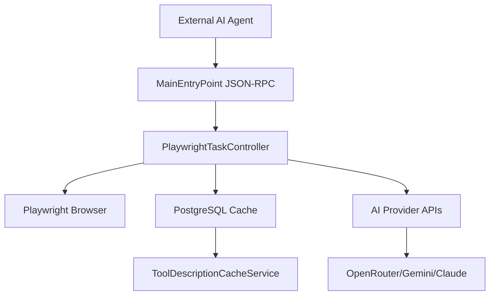

# Tutorial 01: Project Overview - Building an AI-Powered Web Automation Agent

## **What You'll Learn**
In this tutorial, you'll understand the complete architecture of a2aTravelAgent - a Spring Boot-based web automation agent that combines AI, browser automation, and agent-to-agent communication.

## **Learning Objectives**
- ✅ Understand the A2A (Agent-to-Agent) and MCP (Model Context Protocol) architecture
- ✅ Learn how Spring Boot integrates with Playwright for web automation
- ✅ Grasp the AI integration patterns using tools4ai framework
- ✅ See how PostgreSQL caching optimizes AI operations

## **Project Architecture Overview**

### **🏗️ Core Components**



### **📁 Project Structure**
```
a2awebagent/
├── src/main/java/io/wingie/
│   ├── Application.java                    # 🚀 Spring Boot entry point
│   ├── MainEntryPoint.java                # 🔌 JSON-RPC & protocol handler
│   ├── MCPController.java                 # 🧠 AI tool generation with caching
│   ├── playwright/
│   │   ├── PlaywrightTaskController.java  # 🎭 Web automation orchestration
│   │   └── PlaywrightWebBrowsingAction.java # 🌐 Browser actions
│   ├── service/
│   │   ├── ToolDescriptionCacheService.java # 💾 PostgreSQL caching
│   │   └── TaskExecutorService.java       # ⚡ Async task processing
│   └── controller/
│       ├── AgentDashboardController.java  # 📊 UI dashboards
│       └── CacheManagementController.java # 🗄️ Cache API endpoints
├── src/main/resources/
│   ├── tools4ai.properties               # 🤖 AI provider configuration
│   ├── application-docker.yml            # 🐳 Docker configuration
│   └── templates/                        # 🎨 UI templates
└── docker-compose.yml                    # 🔧 Multi-service setup
```

## **Step 1: Understanding the Technology Stack**

### **Backend Framework**
- **Spring Boot 3.2.4**: Application framework with dependency injection
- **Maven**: Build system and dependency management
- **Java 17+**: Programming language with modern features

### **Web Automation**
- **Microsoft Playwright 1.51.0**: Modern browser automation (replaced Selenium)
- **Headless Browser Support**: Chrome, Firefox, Safari automation
- **Screenshot & Data Extraction**: Visual and text-based web scraping

### **AI Integration**
- **tools4ai Framework**: Annotation-based AI tool generation
- **Multiple Providers**: OpenRouter, Google Gemini, Anthropic Claude
- **Natural Language Processing**: Convert human requests to web actions

### **Protocols**
- **A2A (Agent-to-Agent)**: Communication between AI agents
- **MCP (Model Context Protocol)**: Standardized AI tool interfaces
- **JSON-RPC 2.0**: Request/response protocol

### **Data Layer**
- **PostgreSQL**: Primary database for caching and persistence
- **Redis**: Real-time data and pub/sub messaging
- **Neo4j**: Knowledge graphs (future travel data)

## **Step 2: Core Workflows**

### **🔄 Web Automation Flow**
1. **Input**: Natural language request via JSON-RPC
2. **AI Processing**: tools4ai converts to structured actions
3. **Browser Automation**: Playwright executes web interactions
4. **Data Extraction**: Screenshots + text extraction
5. **Response**: Structured results with visual proof

### **💾 Caching Strategy**
1. **Tool Generation**: AI creates tool descriptions
2. **PostgreSQL Storage**: Cache successful generations
3. **Incremental Processing**: Only regenerate missing tools
4. **Error Resilience**: Failed tools don't crash system

## **Step 3: Development Environment Setup**

### **Prerequisites**
```bash
# Required software
- Java 17+
- Maven 3.1+
- Docker & Docker Compose
- Git

# Optional but recommended
- IntelliJ IDEA or VS Code
- PostgreSQL client (pgAdmin)
- Redis client
```

### **Quick Start Commands**
```bash
# Clone and start
git clone <repository>
cd a2awebagent

# Start all services
docker-compose up -d

# Build and run locally
mvn spring-boot:run
```

### **Service URLs**
- **Main Application**: http://localhost:7860
- **Agent Dashboard**: http://localhost:7860/agents
- **PostgreSQL**: http://localhost:5432
- **Redis**: http://localhost:6379
- **Neo4j**: http://localhost:7474

## **Step 4: Key Features**

### **🎭 Web Automation Actions**
```java
@Action(description = "Browse web and return text content")
public String browseWebAndReturnText(String naturalLanguageInstructions)

@Action(description = "Browse web and capture screenshot")  
public String browseWebAndReturnImage(String naturalLanguageInstructions)

@Action(description = "Take screenshot of current page")
public String takeCurrentPageScreenshot()
```

### **📊 Real-time Monitoring**
- **Task Status Tracking**: QUEUED → RUNNING → COMPLETED/FAILED
- **Progress Updates**: Real-time percentage and status messages
- **Server-Sent Events**: Live dashboard updates
- **Error Handling**: Comprehensive logging and recovery

### **🧠 AI Provider Support**
```properties
# tools4ai.properties
agent.provider=openrouter
openAiModelName=google/gemma-3n-e4b-it:free
task.processor.modelName=google/gemma-3n-e4b-it:free
```

## **Step 5: Testing Your Setup**

### **Health Check**
```bash
# Test application health
curl http://localhost:7860/v1/tasks/health

# Test MCP tools
curl http://localhost:7860/v1/tools

# Test web automation
curl -X POST -H "Content-Type: application/json" \
-d '{"name": "browseWebAndReturnText", "arguments": {"provideAllValuesInPlainEnglish": "Go to Google.com"}}' \
http://localhost:7860/v1/tools/call
```

### **Dashboard Access**
1. **Agent Dashboard**: Navigate to http://localhost:7860/agents
2. **Submit Test Task**: Use the form to test web automation
3. **Monitor Progress**: Watch real-time task execution
4. **Review Results**: Check screenshots and extracted data

## **Step 6: Understanding the Innovation**

### **🚀 Phase 1 Achievement: PostgreSQL Caching**
- **Problem**: Tool generation crashes killed entire application
- **Solution**: Incremental caching with error resilience
- **Result**: 60-75% faster startup, zero crash failures

### **🎯 Unique Features**
1. **Multi-Protocol Support**: Both A2A and MCP in one application
2. **AI-Driven Automation**: Natural language → web actions
3. **Visual Proof**: Screenshots for verification
4. **Enterprise Scaling**: Async processing with monitoring

## **Step 7: Next Steps**

After completing this overview, continue with:
- **Tutorial 02**: Docker Setup and Configuration
- **Tutorial 03**: MCP Protocol Deep Dive
- **Tutorial 04**: Understanding Phase 1 Success
- **Tutorial 05**: Playwright Integration

## **Common Use Cases**

### **Travel Research**
```bash
# Example: Plan a trip to Amsterdam
curl -X POST -H "Content-Type: application/json" \
-d '{"query": "Research flights from NYC to Amsterdam in July, find hotels near city center, and discover top attractions"}' \
http://localhost:7860/v1/tasks/submit
```

### **Web Data Extraction**
```bash
# Example: Extract product information
curl -X POST -H "Content-Type: application/json" \
-d '{"query": "Go to Amazon, search for MacBook Pro, and extract prices and ratings"}' \
http://localhost:7860/v1/tasks/submit
```

## **Troubleshooting Quick Reference**

### **Common Issues**
1. **Port Conflicts**: Change ports in application-docker.yml
2. **Docker Memory**: Increase Docker memory allocation
3. **Browser Startup**: Check Playwright container logs
4. **AI API Keys**: Verify tools4ai.properties configuration

### **Log Locations**
- **Application**: `docker-compose logs a2awebagent`
- **Database**: `docker-compose logs postgres`
- **Browser**: Check Playwright container output

## **Key Takeaways**

✅ **a2aTravelAgent combines cutting-edge technologies** for AI-powered web automation  
✅ **Multi-protocol support** enables integration with various AI systems  
✅ **PostgreSQL caching** provides enterprise-grade performance and reliability  
✅ **Spring Boot architecture** ensures scalability and maintainability  
✅ **Playwright automation** delivers reliable, modern web interactions  

## **What's Next?**

Continue to **Tutorial 02: Docker Setup** to get your development environment running smoothly.

---

**Prerequisites for Next Tutorial**: Docker installed and running  
**Estimated Time**: 15 minutes  
**Difficulty**: Beginner