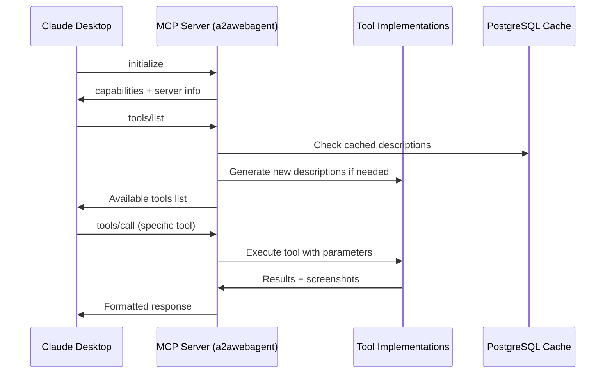

# Tutorial 03: MCP Protocol Setup and Integration

## **What You'll Learn**
Master the Model Context Protocol (MCP) implementation in a2aTravelAgent, understanding how AI agents communicate and discover tools.

## **Learning Objectives**
- ✅ Understand MCP protocol fundamentals and message flow
- ✅ Configure MCP server endpoints and tool discovery
- ✅ Integrate with Claude Desktop and other MCP clients
- ✅ Debug MCP communication and troubleshoot issues
- ✅ Implement custom MCP tools and protocols

## **Prerequisites**
- ✅ Completed Tutorial 02: Docker Setup
- ✅ Running a2awebagent application
- ✅ Understanding of JSON-RPC 2.0 protocol
- ✅ Basic knowledge of AI tool integration

## **Step 1: Understanding MCP Protocol**

### **🤝 What is MCP?**
Model Context Protocol (MCP) is an open standard for connecting AI assistants to external tools and data sources. It enables:
- **Tool Discovery**: AI agents can find available tools
- **Secure Communication**: Standardized message exchange
- **Resource Access**: Files, databases, APIs, web services
- **Bidirectional Flow**: Tools can push updates to AI agents

### **📋 MCP Message Types**
```json
{
  "initialize": "Handshake and capability exchange",
  "tools/list": "Discover available tools", 
  "tools/call": "Execute a specific tool",
  "resources/list": "List available resources",
  "notifications/*": "Real-time updates"
}
```

### **🏗️ MCP Architecture in a2aTravelAgent**


## **Step 2: MCP Server Configuration**

### **🔧 MainEntryPoint MCP Handler**
```java
@RestController
@RequestMapping("/")
public class MainEntryPoint extends JsonRpcController {
    
    @PostMapping
    public Object handleRpc(@RequestBody JsonRpcRequest request) {
        // Route MCP messages through parent JSON-RPC handler
        return super.handleRpc(request);
    }
    
    @Override
    public MCPToolsController getMCPToolsController() {
        return customMCPController; // Our cached version
    }
}
```

### **🎯 MCP Tool Registration**
```java
@Component
public class PlaywrightWebBrowsingAction {
    
    @Action(
        description = "Browse any website and return the text content",
        group = "web_automation"
    )
    public String browseWebAndReturnText(
        @Parameter(description = "Natural language instructions for what to do on the website")
        String provideAllValuesInPlainEnglish
    ) {
        // Implementation handles web automation
        return performWebAutomation(provideAllValuesInPlainEnglish);
    }
}
```

### **🗄️ Tool Description Caching**
```java
@Service
public class MCPController extends MCPToolsController {
    
    @Override
    public void init() {
        log.info("🚀 Starting cached tool description generation...");
        
        // Generate tools with PostgreSQL caching
        Map<GroupInfo, String> groupActions = getGroupActions();
        List<Tool> cachedTools = convertGroupActionsToToolsWithCaching(
            groupActions, getCurrentModel(), processor, transformer
        );
        
        setTools(cachedTools);
        log.info("✅ Tool description generation completed. Generated {} tools", 
                 cachedTools.size());
    }
}
```

## **Step 3: MCP Client Configuration**

### **🖥️ Claude Desktop Integration**
Create or update `~/Library/Application Support/Claude/claude_desktop_config.json` (macOS):
```json
{
  "mcpServers": {
    "a2a-travel-agent": {
      "command": "curl",
      "args": [
        "-X", "POST",
        "-H", "Content-Type: application/json",
        "-d", "{\"jsonrpc\":\"2.0\",\"method\":\"initialize\",\"params\":{},\"id\":1}",
        "http://localhost:7860"
      ],
      "env": {
        "SERVER_URL": "http://localhost:7860"
      }
    }
  }
}
```

### **🔗 Alternative: Direct HTTP Configuration**
```json
{
  "mcpServers": {
    "a2a-travel-agent": {
      "transport": "http",
      "baseUrl": "http://localhost:7860",
      "headers": {
        "Content-Type": "application/json"
      }
    }
  }
}
```

### **🐳 Docker Network Configuration**
For Docker-to-Docker communication:
```json
{
  "mcpServers": {
    "a2a-travel-agent": {
      "transport": "http", 
      "baseUrl": "http://a2awebagent:7860",
      "timeout": 30000
    }
  }
}
```

## **Step 4: Testing MCP Communication**

### **🧪 Manual MCP Testing**
```bash
# 1. Test initialization
curl -X POST -H "Content-Type: application/json" \
-d '{
  "jsonrpc": "2.0",
  "method": "initialize", 
  "params": {},
  "id": 1
}' \
http://localhost:7860

# Expected response:
{
  "jsonrpc": "2.0",
  "id": 1,
  "result": {
    "protocolVersion": "2024-11-05",
    "serverInfo": {
      "name": "a2a-travel-agent",
      "version": "0.0.1"
    },
    "capabilities": {
      "tools": {}
    }
  }
}
```

### **🔍 Tool Discovery Test**
```bash
# 2. List available tools
curl -X POST -H "Content-Type: application/json" \
-d '{
  "jsonrpc": "2.0",
  "method": "tools/list",
  "params": {},
  "id": 2
}' \
http://localhost:7860

# Expected response:
{
  "jsonrpc": "2.0", 
  "id": 2,
  "result": {
    "tools": [
      {
        "name": "browseWebAndReturnText",
        "description": "Browse any website and return the text content",
        "inputSchema": {
          "type": "object",
          "properties": {
            "provideAllValuesInPlainEnglish": {
              "type": "string",
              "description": "Natural language instructions"
            }
          }
        }
      }
    ]
  }
}
```

### **⚡ Tool Execution Test**
```bash
# 3. Execute a tool
curl -X POST -H "Content-Type: application/json" \
-d '{
  "jsonrpc": "2.0",
  "method": "tools/call",
  "params": {
    "name": "browseWebAndReturnText",
    "arguments": {
      "provideAllValuesInPlainEnglish": "Go to example.com and get the page title"
    }
  },
  "id": 3
}' \
http://localhost:7860
```

## **Step 5: Advanced MCP Features**

### **📊 Tool Performance Monitoring**
```java
@Component
public class MCPMetricsCollector {
    
    @EventListener
    public void onToolExecution(ToolExecutionEvent event) {
        // Track execution time
        long executionTime = event.getExecutionTime();
        String toolName = event.getToolName();
        
        // Log to PostgreSQL cache
        cacheService.updateToolMetrics(toolName, executionTime);
        
        // Publish to Redis for real-time monitoring
        redisTemplate.convertAndSend("mcp.metrics", 
            Map.of("tool", toolName, "time", executionTime));
    }
}
```

### **🔄 Real-time Notifications**
```java
@RestController
public class MCPNotificationController {
    
    @PostMapping("/notifications/initialized")
    public ResponseEntity<Void> handleInitialized(@RequestBody Map<String, Object> params) {
        log.info("MCP client initialized with params: {}", params);
        
        // Trigger tool cache warming
        mcpController.warmCache();
        
        return ResponseEntity.noContent().build();
    }
}
```

### **📋 Resource Listing**
```java
@Override
public ListResourcesResult addResources(ListResourcesResult result) {
    // Add application resources that MCP clients can access
    result.getResources().add(Resource.builder()
        .uri("cache://tool-descriptions")
        .name("Tool Description Cache")
        .description("PostgreSQL cached AI tool descriptions")
        .mimeType("application/json")
        .build());
        
    result.getResources().add(Resource.builder()
        .uri("logs://application")
        .name("Application Logs")
        .description("Real-time application logging")
        .mimeType("text/plain")
        .build());
        
    return result;
}
```

## **Step 6: Debugging MCP Issues**

### **🔍 Common MCP Problems**

#### **Problem 1: Tool Discovery Fails**
```bash
# Check logs for tool generation errors
docker-compose logs a2awebagent | grep -i "tool\|mcp\|error"

# Verify cache service is working
curl http://localhost:7860/api/cache/stats

# Test individual tool loading
curl -X POST -H "Content-Type: application/json" \
-d '{"jsonrpc":"2.0","method":"tools/list","id":1}' \
http://localhost:7860
```

#### **Problem 2: Tool Execution Timeout**
```java
// Increase timeout in application-docker.yml
app:
  playwright:
    timeout: 60000  # 60 seconds
  async:
    timeout: 300s   # 5 minutes
```

#### **Problem 3: Cache Miss Issues**
```sql
-- Check PostgreSQL cache status
docker-compose exec postgres psql -U agent -d a2awebagent -c "
SELECT tool_name, provider_model, created_at, usage_count 
FROM tool_descriptions 
ORDER BY created_at DESC;
"

-- Clear problematic cache entries
docker-compose exec postgres psql -U agent -d a2awebagent -c "
DELETE FROM tool_descriptions 
WHERE tool_name = 'problematic_tool_name';
"
```

### **📊 MCP Debugging Dashboard**
Create a debugging endpoint:
```java
@RestController
@RequestMapping("/debug/mcp")
public class MCPDebugController {
    
    @GetMapping("/status")
    public Map<String, Object> getMCPStatus() {
        return Map.of(
            "toolCount", mcpController.getTools().size(),
            "cacheHitRate", cacheService.getCacheHitRate(),
            "lastCacheUpdate", cacheService.getLastUpdateTime(),
            "availableProviders", aiProviderService.getActiveProviders()
        );
    }
    
    @GetMapping("/tools/{toolName}/debug")
    public Map<String, Object> debugTool(@PathVariable String toolName) {
        return Map.of(
            "cached", cacheService.isToolCached(toolName),
            "lastGenerated", cacheService.getLastGenerationTime(toolName),
            "executionCount", cacheService.getExecutionCount(toolName),
            "averageTime", cacheService.getAverageExecutionTime(toolName)
        );
    }
}
```

## **Step 7: Security and Production Considerations**

### **🔒 MCP Security Best Practices**
```java
@Component
public class MCPSecurityFilter {
    
    @Value("${mcp.security.allowedOrigins}")
    private List<String> allowedOrigins;
    
    public boolean isRequestAllowed(HttpServletRequest request) {
        String origin = request.getHeader("Origin");
        String userAgent = request.getHeader("User-Agent");
        
        // Validate origin for web-based MCP clients
        if (origin != null && !allowedOrigins.contains(origin)) {
            log.warn("Blocked MCP request from unauthorized origin: {}", origin);
            return false;
        }
        
        // Rate limiting per client
        String clientId = extractClientId(request);
        return rateLimiter.isAllowed(clientId);
    }
}
```

### **📈 Production MCP Configuration**
```yaml
# application-production.yml
mcp:
  security:
    enabled: true
    allowedOrigins:
      - "https://claude.ai"
      - "https://your-trusted-domain.com"
    rateLimiting:
      enabled: true
      requestsPerMinute: 60
  
  performance:
    cachePrewarm: true
    toolGenerationTimeout: 30s
    maxConcurrentExecutions: 5
    
  monitoring:
    metricsEnabled: true
    logAllRequests: false
    performanceThreshold: 5s
```

## **Step 8: Custom MCP Tool Development**

### **🛠️ Creating New MCP Tools**
```java
@Component
public class CustomTravelTools {
    
    @Action(
        description = "Search for flights between two cities with flexible dates",
        group = "travel_search"
    )
    public String searchFlights(
        @Parameter(description = "Departure city") String from,
        @Parameter(description = "Destination city") String to,
        @Parameter(description = "Preferred travel date (flexible)") String date,
        @Parameter(description = "Budget range") String budget
    ) {
        // Implement flight search logic
        FlightSearchResult result = flightSearchService.search(from, to, date, budget);
        
        // Generate screenshot proof
        String screenshot = playwrightService.captureFlightSearch(result);
        
        return formatFlightResults(result, screenshot);
    }
    
    @Action(
        description = "Get real-time travel alerts and notifications",
        group = "travel_monitoring"
    )
    public String getTravelAlerts(
        @Parameter(description = "Trip ID or destination") String tripId
    ) {
        // Implement travel alert monitoring
        return travelAlertService.getActiveAlerts(tripId);
    }
}
```

### **🔧 Tool Registration Process**
1. **Annotation Scanning**: Spring finds `@Action` methods
2. **Schema Generation**: tools4ai creates JSON schemas
3. **Cache Check**: PostgreSQL lookup for existing descriptions
4. **AI Generation**: Create descriptions for new tools only
5. **MCP Registration**: Tools become available via MCP protocol

## **Step 9: Integration Testing Suite**

### **🧪 Comprehensive MCP Test Suite**
```bash
#!/bin/bash
# test-mcp-integration.sh

BASE_URL="http://localhost:7860"

echo "🚀 Testing MCP Integration..."

# Test 1: Initialization
echo "1. Testing MCP initialization..."
INIT_RESPONSE=$(curl -s -X POST -H "Content-Type: application/json" \
-d '{"jsonrpc":"2.0","method":"initialize","params":{},"id":1}' \
$BASE_URL)

if echo "$INIT_RESPONSE" | grep -q "protocolVersion"; then
    echo "✅ Initialization successful"
else
    echo "❌ Initialization failed"
    exit 1
fi

# Test 2: Tool Discovery
echo "2. Testing tool discovery..."
TOOLS_RESPONSE=$(curl -s -X POST -H "Content-Type: application/json" \
-d '{"jsonrpc":"2.0","method":"tools/list","params":{},"id":2}' \
$BASE_URL)

TOOL_COUNT=$(echo "$TOOLS_RESPONSE" | jq '.result.tools | length')
echo "📊 Found $TOOL_COUNT tools"

# Test 3: Tool Execution
echo "3. Testing tool execution..."
EXEC_RESPONSE=$(curl -s -X POST -H "Content-Type: application/json" \
-d '{
  "jsonrpc":"2.0",
  "method":"tools/call",
  "params":{
    "name":"browseWebAndReturnText",
    "arguments":{"provideAllValuesInPlainEnglish":"Go to example.com"}
  },
  "id":3
}' \
$BASE_URL)

if echo "$EXEC_RESPONSE" | grep -q "Example Domain"; then
    echo "✅ Tool execution successful"
else
    echo "❌ Tool execution failed"
fi

echo "🎉 MCP integration test completed!"
```

## **Key Takeaways**

✅ **MCP provides standardized AI tool communication** across different platforms  
✅ **PostgreSQL caching dramatically improves** tool discovery performance  
✅ **JSON-RPC 2.0 protocol** enables reliable message exchange  
✅ **Security and rate limiting** protect production MCP servers  
✅ **Custom tool development** extends AI agent capabilities  
✅ **Comprehensive testing** ensures reliable MCP integration  

## **What's Next?**

Continue to **Tutorial 04: Phase 1 Success Deep Dive** to understand the PostgreSQL caching breakthrough and its impact.

---

**Prerequisites for Next Tutorial**: Working MCP integration  
**Estimated Time**: 45 minutes  
**Difficulty**: Advanced