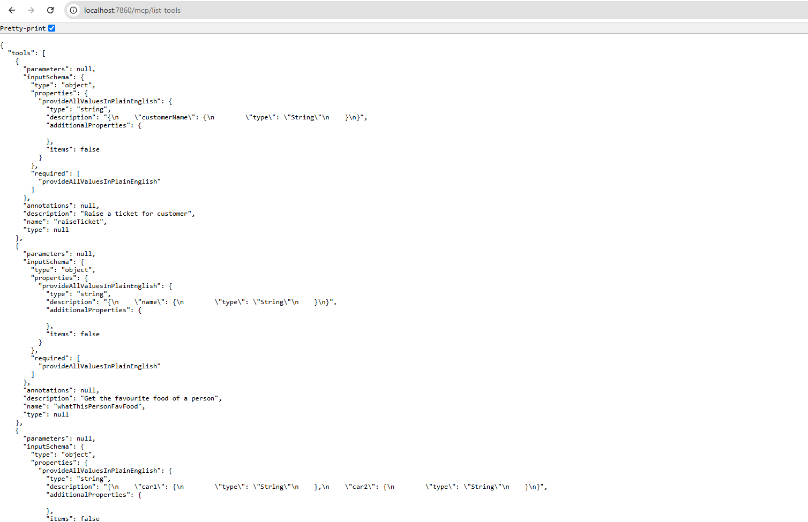
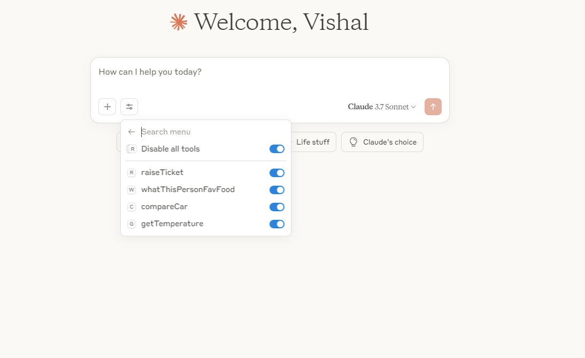
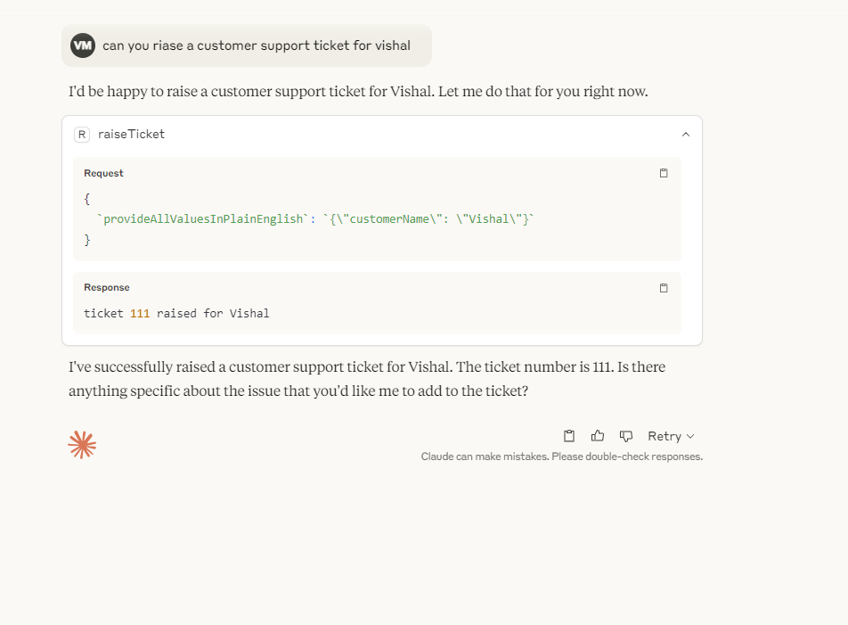
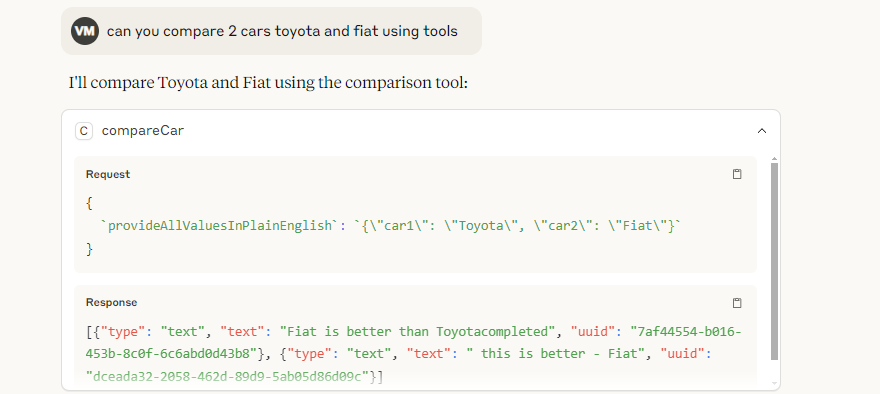

# Tutorial 11: MCP Protocol Implementation with a2acore Framework

## 1. Introduction

The Model Context Protocol (MCP) integration in a2aTravelAgent demonstrates how to build a modern, high-performance MCP server using the a2acore framework with Spring Boot and Playwright. This tutorial shows how to expose web automation capabilities through MCP for seamless integration with Claude Desktop and other AI assistants.



## 2. Architecture Overview

### 2.1 a2acore MCP Framework
```
a2aTravelAgent MCP Architecture:
├── a2acore/                    # Fast MCP Framework
│   ├── @EnableA2ACore         # Autoconfiguration
│   ├── A2aCoreController      # Unified MCP endpoint
│   ├── ToolDiscoveryService   # Auto-discovery of @Action methods
│   └── JsonRpcHandler         # MCP JSON-RPC 2.0 protocol
├── a2awebapp/                 # Application with Tools
│   ├── PlaywrightActions      # Web automation tools
│   ├── TravelResearchAgent    # Travel-specific tools
│   └── PostgreSQL            # Tool description caching
└── mcpserver.js               # Node.js proxy for Claude Desktop
```

### 2.2 Key Features 🚀

- ✅ **Fast Startup**: <5 second startup with PostgreSQL caching
- ✅ **Automatic Tool Discovery**: @Action methods become MCP tools  
- ✅ **Cross-Platform**: Docker-ready with Playwright browser automation
- ✅ **Multi-Provider AI**: OpenRouter, OpenAI, Gemini, Claude integration
- ✅ **Production Ready**: Health checks, metrics, comprehensive logging



## 3. MCP Framework Implementation

### 3.1 Enable a2acore MCP Framework
```java
package io.wingie;

import io.wingie.a2acore.config.EnableA2ACore;
import org.springframework.boot.SpringApplication;
import org.springframework.boot.autoconfigure.SpringBootApplication;

@SpringBootApplication
@EnableA2ACore  // Automatically enables MCP protocol endpoints
public class Application {
    public static void main(String[] args) {
        SpringApplication.run(Application.class, args);
    }
}
```

### 3.2 Core MCP Controller (Auto-configured)
The `@EnableA2ACore` annotation automatically configures:

```java
// Auto-configured by a2acore framework
@RestController
@RequestMapping("/v1")
public class A2aCoreController {
    
    // MCP tool listing endpoint
    @GetMapping("/tools")
    public ResponseEntity<ToolsListResponse> listTools() {
        // Returns all @Action annotated methods as MCP tools
    }
    
    // MCP tool execution endpoint  
    @PostMapping("/tools/call")
    public ResponseEntity<ToolCallResponse> callTool(@RequestBody ToolCallRequest request) {
        // Executes the specified tool with provided arguments
    }
    
    // Generic JSON-RPC 2.0 endpoint
    @PostMapping("")
    public ResponseEntity<Object> handleJsonRpc(@RequestBody JsonRpcRequest request) {
        // Handles generic MCP JSON-RPC requests
    }
    
    // Health and metrics endpoints
    @GetMapping("/health")
    public ResponseEntity<HealthResponse> health() { }
    
    @GetMapping("/metrics") 
    public ResponseEntity<MetricsResponse> metrics() { }
}
```

## 4. Creating MCP Tools with Agents

### 4.1 Basic Web Automation Tool
```java
package io.wingie;

import io.wingie.a2acore.annotations.*;
import org.springframework.stereotype.Service;
import org.springframework.beans.factory.annotation.Autowired;

@Service
@Agent(name = "web-automation", 
       description = "AI-powered web automation with Playwright")
public class WebAutomationAgent {
    
    @Autowired
    private PlaywrightProcessor playwrightProcessor;
    
    @Action(description = "Browse websites and extract information using natural language instructions")
    public String browseWebAndReturnText(
        @Parameter(description = "Natural language web browsing instructions") 
        String provideAllValuesInPlainEnglish) {
        
        try {
            return playwrightProcessor.processSteps(provideAllValuesInPlainEnglish);
        } catch (Exception e) {
            return "Web automation failed: " + e.getMessage();
        }
    }
    
    @Action(description = "Capture website screenshot and return as image") 
    public String browseWebAndReturnImage(
        @Parameter(description = "Website URL and screenshot instructions")
        String provideAllValuesInPlainEnglish) {
        
        try {
            return playwrightProcessor.processStepsWithScreenshot(provideAllValuesInPlainEnglish);
        } catch (Exception e) {
            return "Screenshot capture failed: " + e.getMessage();
        }
    }
}
```

### 4.2 Travel Research MCP Tools  
```java
package io.wingie;

import io.wingie.a2acore.annotations.*;
import org.springframework.stereotype.Service;

@Service
@Agent(name = "travel-research",
       description = "Comprehensive travel research and booking automation")
public class TravelResearchAgent {
    
    @Autowired
    private TravelResearchService travelService;
    
    @Action(description = "Research complete travel options including flights, hotels, and attractions")
    public String researchTravelOptions(
        @Parameter(description = "Origin city") String origin,
        @Parameter(description = "Destination city") String destination,
        @Parameter(description = "Travel date (YYYY-MM-DD)") String travelDate) {
        
        return travelService.researchTravel(origin, destination, travelDate);
    }
    
    @Action(description = "Monitor flight prices and track changes over time")
    public String monitorFlightPrices(
        @Parameter(description = "Flight route (e.g., 'JFK to LAX')") String route,
        @Parameter(description = "Monitoring duration in days") int durationDays) {
        
        return travelService.monitorPrices(route, durationDays);
    }
    
    @Action(description = "Compare prices across multiple booking websites")
    public String compareTravelPrices(
        @Parameter(description = "Travel search criteria") String searchCriteria) {
        
        return travelService.compareAcrossSites(searchCriteria);
    }
}
```



## 5. Generated MCP Tool Schemas

### 5.1 Automatic Schema Generation
The a2acore framework automatically generates MCP tool schemas from your @Action methods:

**Java Code:**
```java
@Action(description = "Research travel options")
public String researchTravelOptions(
    @Parameter(description = "Origin city") String origin,
    @Parameter(description = "Destination city") String destination,
    @Parameter(description = "Travel date") String travelDate) {
    // Implementation
}
```

**Generated MCP Tool Schema:**
```json
{
    "name": "researchTravelOptions",
    "description": "Research complete travel options including flights, hotels, and attractions",
    "inputSchema": {
        "type": "object",
        "properties": {
            "origin": {
                "type": "string",
                "description": "Origin city"
            },
            "destination": {
                "type": "string", 
                "description": "Destination city"
            },
            "travelDate": {
                "type": "string",
                "description": "Travel date (YYYY-MM-DD)"
            }
        },
        "required": ["origin", "destination", "travelDate"]
    }
}
```

### 5.2 Complex Parameter Types
```java
@Action(description = "Process travel booking with complex data")
public BookingResult processBooking(
    @Parameter(description = "Complete booking details") TravelBookingRequest booking) {
    // Framework automatically handles JSON deserialization
    return bookingService.processBooking(booking);
}
```

**Generated Schema for Complex Types:**
```json
{
    "name": "processBooking",
    "inputSchema": {
        "type": "object",
        "properties": {
            "booking": {
                "type": "object",
                "properties": {
                    "origin": {"type": "string"},
                    "destination": {"type": "string"},
                    "passengers": {"type": "integer"},
                    "preferences": {
                        "type": "object",
                        "properties": {
                            "seatType": {"type": "string"},
                            "mealPreference": {"type": "string"}
                        }
                    }
                },
                "required": ["origin", "destination", "passengers"]
            }
        },
        "required": ["booking"]
    }
}
```

## 6. MCP Proxy Server for Claude Desktop

### 6.1 Node.js MCP Server (mcpserver.js)
```javascript
import { Server } from "@modelcontextprotocol/sdk/server/index.js";
import { StdioServerTransport } from "@modelcontextprotocol/sdk/server/stdio.js";
import { ListToolsRequestSchema, CallToolRequestSchema } from "@modelcontextprotocol/sdk/types.js";

const SPRING_BOOT_BASE_URL = process.env.SPRING_BOOT_URL || "http://localhost:7860";

const server = new Server({
    name: "a2a-travel-agent",
    version: "1.0.0",
}, {
    capabilities: {
        tools: {},
    },
});

// Tool listing handler - fetches tools from Spring Boot
server.setRequestHandler(ListToolsRequestSchema, async () => {
    try {
        const response = await fetch(`${SPRING_BOOT_BASE_URL}/v1/tools`);
        if (!response.ok) {
            throw new Error(`HTTP ${response.status}: ${response.statusText}`);
        }
        const data = await response.json();
        return { tools: data.tools };
    } catch (error) {
        console.error("Error fetching tools:", error);
        return { tools: [] };
    }
});

// Tool execution handler - forwards to Spring Boot
server.setRequestHandler(CallToolRequestSchema, async (request) => {
    try {
        const response = await fetch(`${SPRING_BOOT_BASE_URL}/v1/tools/call`, {
            method: "POST",
            headers: { 
                "Content-Type": "application/json",
                "Accept": "application/json"
            },
            body: JSON.stringify({
                name: request.params.name,
                arguments: request.params.arguments || {},
            }),
        });
        
        if (!response.ok) {
            throw new Error(`HTTP ${response.status}: ${response.statusText}`);
        }
        
        const data = await response.json();
        
        // Return properly formatted MCP response
        return {
            content: [
                {
                    type: "text",
                    text: data.result || "Tool executed successfully"
                }
            ]
        };
        
    } catch (error) {
        console.error("Error calling tool:", error);
        return {
            content: [
                {
                    type: "text", 
                    text: `Error: ${error.message}`
                }
            ],
            isError: true
        };
    }
});

// Health check and graceful shutdown
async function runServer() {
    try {
        const transport = new StdioServerTransport();
        await server.connect(transport);
        console.log("a2a-travel-agent MCP server started successfully");
    } catch (error) {
        console.error("Failed to start MCP server:", error);
        process.exit(1);
    }
}

// Handle process signals for graceful shutdown
process.on('SIGINT', () => {
    console.log("Shutting down a2a-travel-agent MCP server...");
    process.exit(0);
});

process.on('SIGTERM', () => {
    console.log("Shutting down a2a-travel-agent MCP server...");
    process.exit(0);
});

runServer().catch(console.error);
```

### 6.2 Package Configuration (package.json)
```json
{
    "name": "a2a-travel-agent-mcp",
    "version": "1.0.0",
    "description": "MCP server for a2aTravelAgent web automation",
    "type": "module",
    "main": "mcpserver.js",
    "dependencies": {
        "@modelcontextprotocol/sdk": "^1.0.4"
    },
    "scripts": {
        "start": "node mcpserver.js",
        "dev": "node --inspect mcpserver.js"
    }
}
```

## 7. Claude Desktop Integration

### 7.1 Configuration Setup
Add to your Claude Desktop configuration file:

**macOS Location:** `~/Library/Application Support/Claude/claude_desktop_config.json`

```json
{
    "mcpServers": {
        "a2a-travel-agent": {
            "command": "node",
            "args": [
                "/Users/wingston/code/a2aTravelAgent/a2awebagent/a2awebapp/src/main/resources/mcpserver.js"
            ],
            "env": {
                "SPRING_BOOT_URL": "http://localhost:7860"
            }
        }
    }
}
```

### 7.2 Usage in Claude Desktop
Once configured, you can use natural language commands:

```
Research travel options from Amsterdam to Palma on July 6th, 2025. 
Include flights, hotels, and attractions with pricing information.
```

Claude will automatically:
1. Call the `researchTravelOptions` MCP tool
2. Execute the travel research automation
3. Return comprehensive results with screenshots



## 8. Advanced MCP Features

### 8.1 Tool Description Caching
```java
@Service
public class ToolDescriptionCacheService {
    
    @Autowired
    private ToolDescriptionRepository repository;
    
    @Cacheable(value = "tool-descriptions", key = "#toolName")
    public ToolDescription getCachedDescription(String toolName) {
        return repository.findByToolName(toolName)
            .orElseGet(() -> generateAndCacheDescription(toolName));
    }
    
    private ToolDescription generateAndCacheDescription(String toolName) {
        // Generate AI-enhanced tool description
        String enhancedDescription = aiService.enhanceDescription(toolName);
        
        ToolDescription cached = new ToolDescription();
        cached.setToolName(toolName);
        cached.setDescription(enhancedDescription);
        cached.setGeneratedAt(LocalDateTime.now());
        
        return repository.save(cached);
    }
}
```

### 8.2 Performance Monitoring
```java
@Component
public class MCPMetricsCollector {
    
    private final MeterRegistry meterRegistry;
    private final Counter toolCallsCounter;
    private final Timer toolExecutionTimer;
    
    public MCPMetricsCollector(MeterRegistry meterRegistry) {
        this.meterRegistry = meterRegistry;
        this.toolCallsCounter = Counter.builder("mcp.tool.calls")
            .description("Number of MCP tool calls")
            .register(meterRegistry);
        this.toolExecutionTimer = Timer.builder("mcp.tool.execution.time")
            .description("MCP tool execution time")
            .register(meterRegistry);
    }
    
    public void recordToolCall(String toolName, Duration executionTime, boolean success) {
        toolCallsCounter.increment(
            Tags.of(
                "tool", toolName,
                "result", success ? "success" : "error"
            )
        );
        
        toolExecutionTimer.record(executionTime,
            Tags.of("tool", toolName)
        );
    }
}
```

### 8.3 Error Handling and Resilience
```java
@ControllerAdvice
public class MCPExceptionHandler {
    
    @ExceptionHandler(ToolExecutionException.class)
    public ResponseEntity<MCPErrorResponse> handleToolExecutionError(
        ToolExecutionException e) {
        
        MCPErrorResponse error = MCPErrorResponse.builder()
            .code(-1)
            .message("Tool execution failed: " + e.getMessage())
            .data(Map.of(
                "tool", e.getToolName(),
                "timestamp", LocalDateTime.now().toString()
            ))
            .build();
            
        return ResponseEntity.badRequest().body(error);
    }
    
    @ExceptionHandler(ValidationException.class)
    public ResponseEntity<MCPErrorResponse> handleValidationError(
        ValidationException e) {
        
        MCPErrorResponse error = MCPErrorResponse.builder()
            .code(-2)
            .message("Invalid parameters: " + e.getMessage())
            .build();
            
        return ResponseEntity.badRequest().body(error);
    }
}
```

## 9. Testing Your MCP Server

### 9.1 Direct API Testing
```bash
# Health check
curl http://localhost:7860/v1/health

# List available MCP tools
curl -H "Content-Type: application/json" -d '{
    "jsonrpc": "2.0",
    "method": "tools/list",
    "id": 1
}' http://localhost:7860/v1

# Execute travel research tool
curl -H "Content-Type: application/json" -d '{
    "jsonrpc": "2.0",
    "method": "tools/call", 
    "params": {
        "name": "researchTravelOptions",
        "arguments": {
            "origin": "New York",
            "destination": "Paris", 
            "travelDate": "2025-08-15"
        }
    },
    "id": 2
}' http://localhost:7860/v1
```

### 9.2 MCP Server Testing
```bash
# Test Node.js MCP server
cd a2awebapp/src/main/resources
npm install
node mcpserver.js

# The server should start and wait for MCP client connections
```

### 9.3 Integration Testing
```java
@SpringBootTest(webEnvironment = SpringBootTest.WebEnvironment.RANDOM_PORT)
class MCPIntegrationTest {
    
    @Autowired
    private TestRestTemplate restTemplate;
    
    @LocalServerPort
    private int port;
    
    @Test
    void testMCPToolListing() {
        String url = "http://localhost:" + port + "/v1/tools";
        
        ResponseEntity<ToolsListResponse> response = restTemplate.getForEntity(
            url, ToolsListResponse.class);
            
        assertThat(response.getStatusCode()).isEqualTo(HttpStatus.OK);
        assertThat(response.getBody().getTools()).isNotEmpty();
    }
    
    @Test
    void testMCPToolExecution() {
        String url = "http://localhost:" + port + "/v1/tools/call";
        
        ToolCallRequest request = ToolCallRequest.builder()
            .name("browseWebAndReturnText")
            .arguments(Map.of("provideAllValuesInPlainEnglish", "Go to Google.com"))
            .build();
            
        ResponseEntity<ToolCallResponse> response = restTemplate.postForEntity(
            url, request, ToolCallResponse.class);
            
        assertThat(response.getStatusCode()).isEqualTo(HttpStatus.OK);
        assertThat(response.getBody().getResult()).isNotNull();
    }
}
```

## 10. Production Deployment

### 10.1 Docker Configuration
```dockerfile
# Dockerfile for MCP-enabled application
FROM openjdk:17-jdk-slim

# Install Node.js for MCP server
RUN apt-get update && apt-get install -y nodejs npm

WORKDIR /app

# Copy application
COPY target/a2awebapp-0.0.1.jar app.jar
COPY src/main/resources/mcpserver.js .
COPY src/main/resources/package.json .

# Install MCP dependencies
RUN npm install

# Install Playwright browsers
RUN npx playwright install chromium

EXPOSE 7860

# Start Spring Boot application
CMD ["java", "-jar", "app.jar"]
```

### 10.2 Health Monitoring
```yaml
# docker-compose.yml health checks
services:
  a2awebagent:
    build: .
    healthcheck:
      test: ["CMD", "curl", "-f", "http://localhost:7860/v1/health"]
      interval: 30s
      timeout: 10s
      retries: 3
      start_period: 40s
```

## 11. Best Practices

### 11.1 MCP Tool Design
- **Clear Descriptions**: Use descriptive tool names and parameter descriptions
- **Appropriate Granularity**: Balance between too many small tools vs. too few large tools
- **Error Handling**: Provide meaningful error messages for MCP clients
- **Parameter Validation**: Validate inputs before processing

### 11.2 Performance Optimization  
- **Caching**: Use PostgreSQL caching for tool descriptions
- **Async Processing**: Use @Async for long-running operations
- **Connection Pooling**: Configure appropriate database connection pools
- **Resource Management**: Properly manage Playwright browser contexts

### 11.3 Security Considerations
- **Input Validation**: Validate all MCP tool parameters
- **URL Safety**: Implement URL safety checks for web automation
- **Rate Limiting**: Implement rate limiting for MCP endpoints
- **Authentication**: Consider authentication for production deployments

## 12. Conclusion

The a2acore MCP framework provides a powerful, production-ready foundation for building sophisticated MCP servers with web automation capabilities. Key advantages:

### 12.1 Framework Benefits
- **Fast Startup**: <5 second startup with PostgreSQL caching
- **Automatic Discovery**: @Action methods become MCP tools automatically
- **Spring Integration**: Full Spring Boot ecosystem compatibility
- **Modern Browser Automation**: Playwright instead of legacy Selenium

### 12.2 Production Features
- **Health Monitoring**: Built-in health checks and metrics
- **Error Handling**: Comprehensive exception handling
- **Performance Monitoring**: Detailed metrics and logging
- **Docker Ready**: Container-based deployment support

### 12.3 Integration Capabilities
- **Claude Desktop**: Seamless integration via MCP protocol
- **Multi-AI Support**: Works with various AI providers
- **Cross-Platform**: Runs consistently across environments
- **Extensible**: Easy to add new tools and capabilities

This MCP implementation demonstrates how modern Java frameworks can create sophisticated AI tool servers that bridge the gap between traditional enterprise applications and cutting-edge AI assistants.