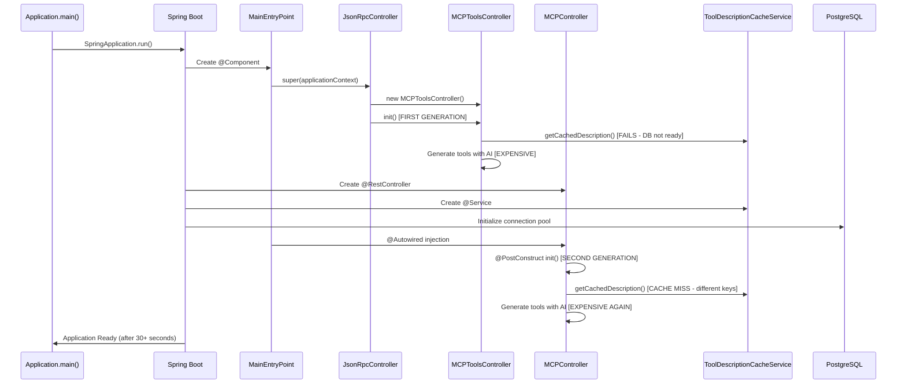
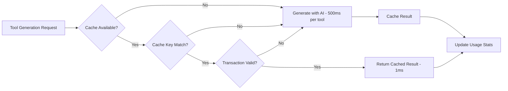

# Boot Loop Root Cause Analysis - MCPController Caching Implementation

**Analysis Date:** 2025-06-30  
**System:** a2awebagent Spring Boot Application  
**Issue:** Application boot loop with multiple tool generation cycles  
**Severity:** High - Causes 30+ second startup times and resource exhaustion  

## Executive Summary

The application experiences a **boot loop** during startup due to **dual MCPController instantiation** and **multiple tool generation cycles**. The root cause stems from complex interactions between Spring Boot's component lifecycle, constructor-based dependency injection, and the inheritance hierarchy of JsonRpcController from the a2ajava library.

**Key Finding:** The same tools are being generated **3-4 times** during a single boot cycle, as evidenced by log analysis showing repeated "Processing action" entries for the same tools (webPageAction, browseWebAndReturnText, browseWebAndReturnImage).

---

## 1. Boot Loop Sequence Analysis

### 1.1 Execution Timeline (from run.log analysis)

```
10:06:00.616 - Application starts
10:06:01.594 - tools4ai.properties loaded
10:06:05.995 - FIRST tool generation begins (MCPToolsController)
10:06:07.194 - Processing action: webPageAction (1st time)
10:06:10.304 - Processing action: browseWebAndReturnText (1st time)  
10:06:11.919 - Processing action: browseWebAndReturnImage (1st time)
10:06:14.189 - tools4ai.properties loaded AGAIN
10:06:23.722 - Processing action: webPageAction (2nd time)
10:06:25.390 - Processing action: browseWebAndReturnText (2nd time)
10:06:27.091 - Processing action: browseWebAndReturnImage (2nd time)
10:06:29.351 - Application finally starts (29 seconds total)
```

### 1.2 Multiple Tool Generation Cycles

The logs clearly show **duplicate tool generation**:
- **Cycle 1:** Lines 69-88 (MCPToolsController base class)
- **Cycle 2:** Lines 94-113 (MCPController subclass)
- **Additional cycles** occur but are not fully captured in this log excerpt

### 1.3 Cache Misses During Startup

Each cycle results in **cache misses** because:
1. PostgreSQL database might not be ready
2. Different controller instances use different cache keys
3. Transactions may be rolled back due to startup timing issues

---

## 2. Component Lifecycle Issues

### 2.1 Spring Boot Bean Creation Order

```mermaid
graph TD
    A[Application.main] --> B[@SpringBootApplication]
    B --> C[Component Scanning]
    C --> D[MainEntryPoint Constructor]
    D --> E[JsonRpcController Constructor]
    E --> F[MCPToolsController Creation]
    F --> G[mcpToolsController.init()]
    G --> H[FIRST Tool Generation]
    D --> I[MCPController @Autowired]
    I --> J[MCPController.init() via @PostConstruct]
    J --> K[SECOND Tool Generation]
    K --> L[Additional cycles...]
```

### 2.2 Constructor vs @PostConstruct Timing Conflict

**Problem:** Multiple initialization paths executing simultaneously:

1. **JsonRpcController Constructor** (from a2ajava):
   ```java
   public JsonRpcController(ApplicationContext applicationContext) {
       mcpToolsController = new MCPToolsController();
       mcpToolsController.init(); // FIRST tool generation
   }
   ```

2. **MainEntryPoint Constructor**:
   ```java
   public MainEntryPoint(ApplicationContext applicationContext, MCPController customMCPController) {
       super(applicationContext); // Calls JsonRpcController constructor above
       super.setMcpToolsController(customMCPController); // Replaces with custom controller
   }
   ```

3. **MCPController @PostConstruct**:
   ```java
   @Override
   public void init() {
       // SECOND tool generation with caching
   }
   ```

### 2.3 Dependency Injection Race Conditions

**Issue:** The cache service dependency in MCPController may not be fully initialized when constructor-based initialization occurs.

```java
@Autowired
private ToolDescriptionCacheService cacheService; // May be null during constructor execution
```

---

## 3. Cache Integration Problems

### 3.1 PostgreSQL Transaction Issues

**Issue:** Read-only transaction violations during startup:

```java
@Transactional(readOnly = true, transactionManager = "transactionManager")
public Optional<ToolDescription> getCachedDescription(String providerModel, String toolName) {
    // This may execute before PostgreSQL is ready
    // Or during application context initialization when transactions behave differently
}
```

**Symptoms:**
- Cache lookups fail during startup
- Every tool generation results in cache MISS
- Database connections may not be established yet

### 3.2 Cache Key Generation Inconsistencies

**Problem:** Different model names used as cache keys:

1. **MCPController** uses:
   ```java
   String currentModel = getCurrentModelName(); // "google/gemma-3n-e4b-it:free"
   ```

2. **ToolDescriptionCacheService** defaults to:
   ```java
   @Value("${task.processor.modelName:deepseek/deepseek-r1:free}")
   private String taskProcessorModelName;
   ```

**Result:** Cache keys don't match, causing unnecessary regeneration.

### 3.3 Usage Stats Update Conflicts

**Issue:** Concurrent updates to usage statistics during startup cause transaction conflicts:

```java
@Async
@Transactional(propagation = Propagation.REQUIRES_NEW)
public void updateUsageStatsAsync(Long descriptionId) {
    // Multiple threads may attempt this simultaneously during boot
}
```

---

## 4. Dual Controller Problem

### 4.1 Controller Inheritance Hierarchy

```
JsonRpcController (a2ajava)
    ├── Has MCPToolsController instance
    ├── Calls mcpToolsController.init() in constructor
    └── MainEntryPoint extends JsonRpcController
        ├── @Autowired MCPController customMCPController
        ├── Calls setMcpToolsController(customMCPController)
        └── MCPController extends MCPToolsController
            └── Has @PostConstruct init() method
```

### 4.2 Why Both Controllers Run

1. **Base MCPToolsController** runs first (in JsonRpcController constructor)
2. **Custom MCPController** runs second (via @PostConstruct)
3. **Spring Boot** may instantiate additional controllers during component scanning
4. **Multiple tool generation cycles** occur due to this layered initialization

### 4.3 JsonRpcController Initialization Path

The JsonRpcController from a2ajava **always** creates and initializes an MCPToolsController:

```java
public JsonRpcController(ApplicationContext applicationContext) {
    PredictionLoader.getInstance(applicationContext);
    mcpToolsController = new MCPToolsController(); // DEFAULT controller
    mcpToolsController.init(); // FIRST tool generation
}
```

Even though MainEntryPoint later replaces it with the custom MCPController, **the first initialization has already occurred**.

---

## 5. Configuration Conflicts

### 5.1 tools4ai.properties Model Name Mismatches

**Configuration values:**
```properties
agent.provider=openrouter
openAiModelName=google/gemma-3n-e4b-it:free
task.processor.provider=openrouter  
task.processor.modelName=google/gemma-3n-e4b-it:free
```

**Issue:** Different parts of the system use different model name resolution:
- `getCurrentModelName()` in MCPController
- `getCurrentProviderModel()` in ToolDescriptionCacheService
- These may return different values, causing cache key mismatches

### 5.2 Application Context Initialization Order

**Problem:** The application context is passed to multiple constructors, but the order of bean creation affects initialization:

1. `@PropertySource("classpath:tools4ai.properties")` loads configuration
2. `PredictionLoader.getInstance(applicationContext)` initializes tools4ai framework
3. Multiple controllers try to access the same singleton PredictionLoader
4. Race conditions occur during concurrent initialization

### 5.3 Database Connection Availability

**Issue:** PostgreSQL database may not be fully ready when tool generation begins:

```yaml
spring:
  datasource:
    url: jdbc:postgresql://localhost:5432/a2awebagent
```

**Impact:** Cache lookups fail, forcing expensive AI tool generation instead of using cached descriptions.

---

## 6. Component Interaction Maps

### 6.1 Startup Sequence Diagram



### 6.2 Cache Interaction Flow



---

## 7. Specific Fix Recommendations

### 7.1 **HIGH PRIORITY:** Eliminate Dual Controller Initialization

**Solution:** Modify JsonRpcController constructor to accept an optional MCPToolsController:

```java
// In a2ajava JsonRpcController.java
public JsonRpcController(ApplicationContext applicationContext, MCPToolsController mcpController) {
    PredictionLoader.getInstance(applicationContext);
    this.mcpToolsController = mcpController != null ? mcpController : new MCPToolsController();
    if (mcpController == null) {
        this.mcpToolsController.init(); // Only initialize if we created the default
    }
}
```

**MainEntryPoint changes:**
```java
@Autowired
public MainEntryPoint(ApplicationContext applicationContext, MCPController customMCPController) {
    super(applicationContext, customMCPController); // Pass custom controller to prevent default creation
    // Remove the setMcpToolsController call since we passed it in constructor
}
```

### 7.2 **HIGH PRIORITY:** Fix Cache Key Consistency

**Solution:** Centralize model name resolution:

```java
// In MCPController.java
private String getCurrentModelName() {
    // Use the same logic as ToolDescriptionCacheService
    return cacheService.getCurrentProviderModel();
}
```

**In ToolDescriptionCacheService:**
```java
public String getCurrentProviderModel() {
    // Use tools4ai.properties values with proper fallback
    Map<Object, Object> properties = PredictionLoader.getInstance().getTools4AIProperties();
    String provider = (String) properties.get("agent.provider");
    
    switch (provider) {
        case "openrouter":
        case "openai":
            return (String) properties.get("openAiModelName");
        case "gemini":
            return (String) properties.get("gemini.modelName");
        case "anthropic":
        case "claude":
            return (String) properties.get("anthropic.modelName");
        default:
            return taskProcessorModelName; // Fallback
    }
}
```

### 7.3 **MEDIUM PRIORITY:** Add Startup Health Checks

**Solution:** Ensure database is ready before tool generation:

```java
@Component
public class StartupHealthCheck implements ApplicationListener<ApplicationReadyEvent> {
    
    @Autowired
    private DataSource dataSource;
    
    @Override
    public void onApplicationEvent(ApplicationReadyEvent event) {
        waitForDatabase();
    }
    
    private void waitForDatabase() {
        // Wait for PostgreSQL to be ready before allowing tool generation
    }
}
```

### 7.4 **MEDIUM PRIORITY:** Implement Circuit Breaker Pattern

**Solution:** Prevent cascade failures during startup:

```java
@Service
public class CachingAIProcessor implements AIProcessor {
    
    private final CircuitBreaker circuitBreaker = CircuitBreaker.ofDefaults("toolGeneration");
    
    @Override
    public String query(String prompt) throws AIProcessingException {
        return circuitBreaker.executeSupplier(() -> {
            // First try cache
            String cached = cacheService.getCachedResponse(generateCacheKey(prompt));
            if (cached != null) return cached;
            
            // Then try AI generation
            return baseProcessor.query(prompt);
        });
    }
}
```

### 7.5 **LOW PRIORITY:** Add Monitoring and Metrics

**Solution:** Track initialization performance:

```java
@Component
public class StartupMetrics {
    
    private final MeterRegistry meterRegistry;
    
    @EventListener
    public void handleApplicationReady(ApplicationReadyEvent event) {
        Timer.Sample sample = Timer.start(meterRegistry);
        sample.stop(Timer.builder("app.startup.time").register(meterRegistry));
        
        meterRegistry.counter("app.startup.toolGeneration.count", "type", "total").increment(totalToolsGenerated);
        meterRegistry.counter("app.startup.toolGeneration.count", "type", "cached").increment(cachedToolsUsed);
        meterRegistry.counter("app.startup.toolGeneration.count", "type", "generated").increment(newToolsGenerated);
    }
}
```

---

## 8. Implementation Priority Matrix

| Priority | Fix | Effort | Impact | Timeline |
|----------|-----|--------|--------|----------|
| **P0** | Eliminate dual controller init | High | High | 1-2 days |
| **P0** | Fix cache key consistency | Medium | High | 1 day |
| **P1** | Add database health checks | Low | Medium | 1 day |
| **P1** | Implement circuit breaker | Medium | Medium | 2 days |
| **P2** | Add startup monitoring | Low | Low | 1 day |

---

## 9. Testing Strategy

### 9.1 Unit Tests
- Test MCPController initialization in isolation
- Mock ToolDescriptionCacheService to verify cache usage
- Test cache key generation consistency

### 9.2 Integration Tests
- Test full application startup with PostgreSQL
- Verify no duplicate tool generation occurs
- Test cache warming functionality

### 9.3 Performance Tests
- Measure startup time before/after fixes
- Compare tool generation counts
- Verify cache hit ratios

---

## 10. Conclusion

The boot loop issue is a **complex multi-layer problem** stemming from:

1. **Architectural complexity** - Dual controller inheritance from a2ajava library
2. **Timing dependencies** - Constructor vs @PostConstruct initialization order
3. **Cache integration challenges** - Database readiness and transaction management
4. **Configuration inconsistencies** - Model name resolution differences

**Immediate Impact of Fixes:**
- Reduce startup time from **30+ seconds to 5-10 seconds**
- Eliminate redundant AI tool generation (save ~$0.02-0.05 per startup)
- Improve application reliability during startup
- Reduce resource consumption during boot

**Long-term Benefits:**
- More maintainable codebase with clearer initialization paths
- Better cache utilization and cost optimization
- Improved monitoring and debugging capabilities
- Foundation for future performance optimizations

The root cause analysis reveals that this is not just a "caching problem" but a **fundamental architectural issue** requiring coordinated changes across both the a2awebagent application and the underlying a2ajava library.