# Solution Comparison Matrix - MCPController Caching and Boot Loop Resolution

**Document Version:** 1.0  
**Created:** June 30, 2025  
**Author:** Wingie Development Team  
**Status:** Decision Framework  

---

## Executive Summary

This document provides a comprehensive decision matrix comparing four strategic approaches to resolve the MCPController caching and boot loop issues in the a2awebagent project. The analysis evaluates technical complexity, maintenance overhead, performance impact, and long-term viability to guide the optimal implementation strategy.

### Critical Issue Context
- **Current Problem:** 30+ second startup times due to dual MCPController instantiation
- **Root Cause:** Multiple tool generation cycles with cache misses
- **Business Impact:** Poor developer experience, increased AI costs, resource waste
- **Urgency:** High - affects daily development workflow

### Evaluated Approaches
1. **Spring Boot Exclusion Strategy** - Exclude library controllers via component scanning
2. **a2ajava Forking Strategy** - Fork library for direct cache integration
3. **Hybrid Approach** - Combine exclusion with selective forking
4. **Status Quo Plus** - Minimal fixes to current implementation

---

## 1. Approach Comparison Matrix

### 1.1 Strategic Overview

| Approach | Core Strategy | Primary Benefit | Primary Risk |
|----------|---------------|-----------------|---------------|
| **Spring Boot Exclusion** | Use Spring's component scanning to exclude library controllers | Clean separation, no fork maintenance | Library update fragility |
| **a2ajava Forking** | Fork library to integrate caching directly | Complete control, guaranteed performance | High maintenance burden |
| **Hybrid Approach** | Selective forking with Spring Boot exclusions | Balanced control and maintenance | Increased complexity |
| **Status Quo Plus** | Minimal fixes to current dual-controller setup | Lowest immediate effort | Doesn't address root cause |

### 1.2 Technical Architecture Comparison

```mermaid
graph TB
    subgraph "Spring Boot Exclusion"
        A1[Application] --> A2[Spring Component Scanning]
        A2 --> A3[Exclude Library MCPController]
        A3 --> A4[Custom MCPController Only]
        A4 --> A5[PostgreSQL Cache]
    end
    
    subgraph "a2ajava Forking"
        B1[Application] --> B2[Forked a2ajava Library]
        B2 --> B3[Modified MCPToolsController]
        B3 --> B4[Direct Cache Integration]
        B4 --> B5[PostgreSQL Cache]
    end
    
    subgraph "Hybrid Approach"
        C1[Application] --> C2[Spring Exclusion + Selective Fork]
        C2 --> C3[Core Classes Forked]
        C3 --> C4[Non-Core Classes Excluded]
        C4 --> C5[PostgreSQL Cache]
    end
    
    subgraph "Status Quo Plus"
        D1[Application] --> D2[Dual Controllers]
        D2 --> D3[Coordination Logic]
        D3 --> D4[Shared Cache]
        D4 --> D5[PostgreSQL Cache]
    end
```

---

## 2. Detailed Evaluation Criteria

### 2.1 Technical Complexity

#### Implementation Difficulty (1-10 scale, 1 = simplest)

| Approach | Score | Complexity Factors |
|----------|-------|-------------------|
| **Spring Boot Exclusion** | 3 | Component scanning configuration, conditional beans |
| **a2ajava Forking** | 8 | Package refactoring, dependency management, merge conflicts |
| **Hybrid Approach** | 9 | Combines complexities of both approaches |
| **Status Quo Plus** | 2 | Minimal changes to existing code |

#### Technical Debt Assessment

| Approach | Debt Level | Rationale |
|----------|------------|-----------|
| **Spring Boot Exclusion** | Low | Uses Spring Boot best practices |
| **a2ajava Forking** | High | Duplicate code maintenance, version management |
| **Hybrid Approach** | Medium | Selective complexity, manageable with proper boundaries |
| **Status Quo Plus** | High | Doesn't address architectural issues |

### 2.2 Maintenance Overhead

#### Ongoing Effort Requirements (hours/month)

| Approach | Monthly Hours | Maintenance Tasks |
|----------|---------------|-------------------|
| **Spring Boot Exclusion** | 2-4 | Monitor library updates, adjust exclusion patterns |
| **a2ajava Forking** | 8-16 | Merge upstream changes, test compatibility, version management |
| **Hybrid Approach** | 6-12 | Selective merge management, boundary maintenance |
| **Status Quo Plus** | 1-2 | Minimal fixes, firefighting |

#### Update Compatibility Risk

| Approach | Risk Level | Mitigation Strategy |
|----------|------------|-------------------|
| **Spring Boot Exclusion** | Medium | Version-agnostic exclusion patterns, thorough testing |
| **a2ajava Forking** | Low | Complete control over updates, structured merge process |
| **Hybrid Approach** | Medium | Selective impact analysis, focused testing |
| **Status Quo Plus** | High | Vulnerable to all upstream changes |

### 2.3 Performance Impact

#### Startup Time Projections

| Approach | Current (30s) | Projected | Improvement |
|----------|---------------|-----------|-------------|
| **Spring Boot Exclusion** | 30s | 3-5s | 85-90% |
| **a2ajava Forking** | 30s | 1-3s | 90-95% |
| **Hybrid Approach** | 30s | 2-4s | 87-93% |
| **Status Quo Plus** | 30s | 20-25s | 17-33% |

#### Cache Effectiveness

| Approach | Cache Hit Rate | AI Cost Reduction |
|----------|----------------|-------------------|
| **Spring Boot Exclusion** | 85-90% | 80-85% |
| **a2ajava Forking** | 90-95% | 85-90% |
| **Hybrid Approach** | 87-92% | 82-87% |
| **Status Quo Plus** | 60-70% | 50-60% |

#### Resource Utilization

| Approach | Memory Usage | CPU Usage | I/O Operations |
|----------|--------------|-----------|---------------|
| **Spring Boot Exclusion** | +5-10MB | Standard | Reduced (single controller) |
| **a2ajava Forking** | +2-5MB | Optimized | Minimal (direct integration) |
| **Hybrid Approach** | +7-12MB | Mixed | Selective reduction |
| **Status Quo Plus** | +15-20MB | Elevated | High (dual processing) |

### 2.4 Risk Assessment

#### Technical Risks

| Risk Category | Spring Boot | Forking | Hybrid | Status Quo |
|---------------|-------------|---------|---------|------------|
| **Version Compatibility** | High | Low | Medium | High |
| **Security Updates** | Low | High | Medium | Medium |
| **Component Conflicts** | Low | Low | Medium | High |
| **Debugging Complexity** | Medium | Low | High | High |
| **Deployment Issues** | Low | Medium | Medium | High |

#### Business Risks

| Risk Category | Spring Boot | Forking | Hybrid | Status Quo |
|---------------|-------------|---------|---------|------------|
| **Development Velocity** | High Impact | Medium Impact | High Impact | Low Impact |
| **Team Adoption** | Easy | Complex | Moderate | Immediate |
| **Scalability** | Excellent | Excellent | Good | Poor |
| **Cost Predictability** | Good | Excellent | Good | Poor |

### 2.5 Development Time Investment

#### Initial Implementation Timeline

| Phase | Spring Boot | Forking | Hybrid | Status Quo |
|-------|-------------|---------|---------|------------|
| **Analysis** | 1 day | 2 days | 3 days | 0.5 days |
| **Implementation** | 3-5 days | 10-14 days | 7-10 days | 1-2 days |
| **Testing** | 2-3 days | 5-7 days | 4-6 days | 1 day |
| **Documentation** | 1 day | 2-3 days | 2 days | 0.5 days |
| **Total** | 7-10 days | 19-26 days | 16-21 days | 3-4 days |

#### Resource Requirements

| Approach | Developer Skill Level | Team Size | External Dependencies |
|----------|---------------------|-----------|---------------------|
| **Spring Boot Exclusion** | Senior Spring Developer | 1-2 | Spring Boot expertise |
| **a2ajava Forking** | Expert Java Developer | 1-2 | Git management, Maven |
| **Hybrid Approach** | Expert Full-Stack | 2-3 | Multiple skill sets |
| **Status Quo Plus** | Mid-level Developer | 1 | Minimal |

### 2.6 Long-term Viability

#### Future-Proofing Score (1-10)

| Approach | Score | Viability Factors |
|----------|-------|-------------------|
| **Spring Boot Exclusion** | 8 | Leverages Spring Boot evolution, widely adopted patterns |
| **a2ajava Forking** | 6 | Depends on upstream activity, maintenance commitment |
| **Hybrid Approach** | 7 | Flexible adaptation to changing requirements |
| **Status Quo Plus** | 3 | Unsustainable, doesn't scale |

#### Technology Alignment

| Approach | Spring Boot | Java Ecosystem | AI/ML Trends |
|----------|-------------|----------------|--------------|
| **Spring Boot Exclusion** | Excellent | Good | Good |
| **a2ajava Forking** | Good | Excellent | Excellent |
| **Hybrid Approach** | Good | Good | Good |
| **Status Quo Plus** | Poor | Poor | Poor |

---

## 3. Cost-Benefit Analysis

### 3.1 Development Cost Breakdown

#### Initial Investment

| Cost Category | Spring Boot | Forking | Hybrid | Status Quo |
|---------------|-------------|---------|---------|------------|
| **Development Time** | $8,000-12,000 | $25,000-35,000 | $20,000-28,000 | $3,000-5,000 |
| **Testing & QA** | $3,000-5,000 | $8,000-12,000 | $6,000-10,000 | $1,000-2,000 |
| **Documentation** | $1,000-2,000 | $3,000-5,000 | $2,000-4,000 | $500-1,000 |
| **Training** | $2,000-3,000 | $5,000-8,000 | $4,000-6,000 | $500-1,000 |
| **Total Initial** | $14,000-22,000 | $41,000-60,000 | $32,000-48,000 | $5,000-9,000 |

#### Ongoing Costs (Annual)

| Cost Category | Spring Boot | Forking | Hybrid | Status Quo |
|---------------|-------------|---------|---------|------------|
| **Maintenance** | $3,000-6,000 | $12,000-24,000 | $8,000-16,000 | $2,000-4,000 |
| **Updates** | $2,000-4,000 | $8,000-16,000 | $5,000-10,000 | $1,000-2,000 |
| **Monitoring** | $1,000-2,000 | $2,000-4,000 | $1,500-3,000 | $500-1,000 |
| **Total Annual** | $6,000-12,000 | $22,000-44,000 | $14,500-29,000 | $3,500-7,000 |

### 3.2 Benefit Quantification

#### Performance Savings (Annual)

| Benefit Category | Spring Boot | Forking | Hybrid | Status Quo |
|------------------|-------------|---------|---------|------------|
| **Developer Time Savings** | $25,000-35,000 | $30,000-40,000 | $27,000-37,000 | $5,000-8,000 |
| **AI Cost Reduction** | $2,000-4,000 | $2,500-5,000 | $2,200-4,500 | $800-1,500 |
| **Infrastructure Savings** | $1,000-2,000 | $1,500-3,000 | $1,200-2,500 | $200-500 |
| **Total Annual Benefits** | $28,000-41,000 | $34,000-48,000 | $30,400-44,000 | $6,000-10,000 |

#### ROI Calculation (3-year projection)

| Approach | Initial Investment | 3-Year Maintenance | 3-Year Benefits | Net ROI |
|----------|-------------------|-------------------|-----------------|---------|
| **Spring Boot Exclusion** | $18,000 | $24,000 | $103,500 | **+146%** |
| **a2ajava Forking** | $50,500 | $99,000 | $123,000 | **-18%** |
| **Hybrid Approach** | $40,000 | $65,250 | $111,600 | **+6%** |
| **Status Quo Plus** | $7,000 | $15,750 | $24,000 | **+5%** |

### 3.3 Risk-Adjusted Return

#### Success Probability Weighting

| Approach | Success Probability | Risk-Adjusted ROI |
|----------|-------------------|-------------------|
| **Spring Boot Exclusion** | 85% | **+124%** |
| **a2ajava Forking** | 70% | **-32%** |
| **Hybrid Approach** | 75% | **-2%** |
| **Status Quo Plus** | 60% | **+3%** |

---

## 4. Decision Framework

### 4.1 Technical Decision Criteria

#### Must-Have Requirements

| Requirement | Spring Boot | Forking | Hybrid | Status Quo |
|-------------|-------------|---------|---------|------------|
| **Eliminate Boot Loop** | ✅ | ✅ | ✅ | ❌ |
| **Reduce Startup Time >80%** | ✅ | ✅ | ✅ | ❌ |
| **Maintain AI Cost Efficiency** | ✅ | ✅ | ✅ | ⚠️ |
| **Preserve Existing Functionality** | ✅ | ✅ | ✅ | ✅ |

#### Should-Have Requirements

| Requirement | Spring Boot | Forking | Hybrid | Status Quo |
|-------------|-------------|---------|---------|------------|
| **Easy to Maintain** | ✅ | ❌ | ⚠️ | ✅ |
| **Future-Proof Architecture** | ✅ | ⚠️ | ✅ | ❌ |
| **Transparent to End Users** | ✅ | ✅ | ✅ | ✅ |
| **Minimal Team Training** | ✅ | ❌ | ⚠️ | ✅ |

#### Could-Have Requirements

| Requirement | Spring Boot | Forking | Hybrid | Status Quo |
|-------------|-------------|---------|---------|------------|
| **Custom Performance Optimizations** | ⚠️ | ✅ | ✅ | ❌ |
| **Advanced Debugging Capabilities** | ⚠️ | ✅ | ✅ | ❌ |
| **Independent Release Cycle** | ❌ | ✅ | ⚠️ | ❌ |

### 4.2 Business Impact Considerations

#### Stakeholder Impact Matrix

| Stakeholder | Spring Boot | Forking | Hybrid | Status Quo |
|-------------|-------------|---------|---------|------------|
| **Developers** | High Positive | Medium Positive | Medium Positive | Low Negative |
| **DevOps Team** | Medium Positive | High Negative | Medium Negative | Low Negative |
| **Product Owners** | High Positive | Medium Positive | Medium Positive | High Negative |
| **End Users** | No Impact | No Impact | No Impact | No Impact |

#### Strategic Alignment

| Strategic Goal | Spring Boot | Forking | Hybrid | Status Quo |
|----------------|-------------|---------|---------|------------|
| **Rapid Development** | ✅ | ❌ | ⚠️ | ❌ |
| **Cost Optimization** | ✅ | ❌ | ⚠️ | ❌ |
| **Technical Excellence** | ✅ | ✅ | ✅ | ❌ |
| **Market Responsiveness** | ✅ | ⚠️ | ⚠️ | ❌ |

### 4.3 Resource Availability Assessment

#### Team Capacity Analysis

| Resource Type | Available | Spring Boot | Forking | Hybrid | Status Quo |
|---------------|-----------|-------------|---------|---------|------------|
| **Senior Java Developers** | 2 | 1 Required | 1-2 Required | 2 Required | 1 Required |
| **Spring Boot Experts** | 1 | 1 Required | 0 Required | 1 Required | 0 Required |
| **DevOps Engineers** | 1 | 0.5 Required | 1 Required | 0.5 Required | 0 Required |
| **Time Availability (weeks)** | 4-6 | 2-3 Required | 6-8 Required | 4-6 Required | 1 Required |

#### Skill Gap Analysis

| Skill Area | Current Level | Spring Boot | Forking | Hybrid | Status Quo |
|------------|---------------|-------------|---------|---------|------------|
| **Spring Boot Advanced** | Medium | High Need | Low Need | Medium Need | Low Need |
| **Git/Maven Management** | Medium | Low Need | High Need | Medium Need | Low Need |
| **Library Maintenance** | Low | Low Need | High Need | Medium Need | Low Need |
| **PostgreSQL Performance** | Medium | Medium Need | Medium Need | Medium Need | Low Need |

### 4.4 Timeline Constraints

#### Critical Milestones

| Milestone | Target Date | Spring Boot | Forking | Hybrid | Status Quo |
|-----------|-------------|-------------|---------|---------|------------|
| **Proof of Concept** | 1 week | ✅ | ❌ | ⚠️ | ✅ |
| **MVP Implementation** | 3 weeks | ✅ | ❌ | ⚠️ | ✅ |
| **Production Ready** | 6 weeks | ✅ | ❌ | ✅ | ✅ |
| **Full Feature Parity** | 8 weeks | ✅ | ✅ | ✅ | ⚠️ |

---

## 5. Recommendations

### 5.1 Primary Recommendation: Spring Boot Exclusion Strategy

#### Executive Summary
**Recommendation**: Implement the Spring Boot Exclusion Strategy as the primary solution.

#### Rationale
1. **Optimal ROI**: +146% risk-adjusted return over 3 years
2. **Manageable Complexity**: Moderate implementation effort with high impact
3. **Future-Proof**: Leverages Spring Boot best practices and ecosystem evolution
4. **Team Alignment**: Matches current team skills and capacity
5. **Quick Time-to-Value**: 2-3 weeks to production-ready solution

#### Implementation Priorities
1. **Phase 1 (Week 1)**: Component scanning exclusion configuration
2. **Phase 2 (Week 2)**: Enhanced MCPController with conditional beans
3. **Phase 3 (Week 3)**: Testing, monitoring, and documentation
4. **Phase 4 (Week 4)**: Production deployment and optimization

#### Success Metrics
- Startup time reduction from 30s to 3-5s (85-90% improvement)
- Cache hit rate >85%
- Zero boot loop incidents
- Developer satisfaction >90%

### 5.2 Alternative Recommendation: Hybrid Approach

#### When to Consider
- **High Customization Needs**: Require specific library modifications
- **Long-term Strategic Control**: Need selective control over library components
- **Resource Availability**: Have dedicated team for complex implementation

#### Implementation Strategy
1. **Selective Forking**: Only fork critical components (MCPToolsController, key interfaces)
2. **Spring Boot Integration**: Use exclusion patterns for non-forked components
3. **Boundary Management**: Clear separation between forked and excluded components

### 5.3 Fallback Option: Status Quo Plus

#### Emergency Scenario
If time constraints prevent major implementation:
1. **Immediate Fixes**: Implement minimal dual-controller coordination
2. **Performance Patches**: Add basic caching layer
3. **Monitoring**: Implement startup time tracking
4. **Migration Plan**: Prepare for Spring Boot Exclusion implementation

#### Limitations
- Only 17-33% startup time improvement
- Doesn't address root architectural issues
- High technical debt accumulation
- Poor long-term scalability

### 5.4 Not Recommended: a2ajava Forking Strategy

#### Reasons Against
1. **Negative ROI**: -18% return over 3 years
2. **High Maintenance Burden**: 8-16 hours monthly ongoing effort
3. **Resource Intensive**: Requires 6-8 weeks initial implementation
4. **Team Capacity Mismatch**: Exceeds current team expertise
5. **Strategic Misalignment**: Doesn't support rapid development goals

#### Exceptions
Consider only if:
- Deep library customization absolutely required
- Dedicated maintenance team available
- Independent release cycle mandatory
- Long-term strategic control critical

---

## 6. Implementation Roadmap

### 6.1 Spring Boot Exclusion Implementation Plan

#### Week 1: Foundation Setup
- **Day 1-2**: Update Application.java with exclusion filters
- **Day 3-4**: Enhance MCPController with conditional annotations
- **Day 5**: Basic integration testing

#### Week 2: Integration & Optimization
- **Day 1-2**: Update MainEntryPoint with qualifier injection
- **Day 3-4**: Implement cache key consistency fixes
- **Day 5**: Performance testing and optimization

#### Week 3: Testing & Validation
- **Day 1-2**: Comprehensive unit and integration testing
- **Day 3-4**: Performance benchmarking
- **Day 5**: Documentation and training materials

#### Week 4: Production Deployment
- **Day 1-2**: Staging environment validation
- **Day 3**: Production deployment
- **Day 4-5**: Monitoring and fine-tuning

### 6.2 Success Milestones

#### Technical Milestones
- [ ] Single MCPController instance in application context
- [ ] Startup time <5 seconds consistently
- [ ] Cache hit rate >85%
- [ ] Zero component scanning conflicts
- [ ] All MCP endpoints functional

#### Business Milestones
- [ ] Developer productivity increase >50%
- [ ] AI cost reduction >80%
- [ ] Zero production startup issues
- [ ] Team adoption >90%
- [ ] Documentation completeness >95%

### 6.3 Risk Mitigation Plan

#### High-Risk Scenarios
1. **Library Update Breaks Exclusions**
   - Mitigation: Version-agnostic exclusion patterns
   - Contingency: Rapid rollback to working version

2. **Performance Degradation**
   - Mitigation: Comprehensive performance testing
   - Contingency: Circuit breaker patterns

3. **Team Adoption Challenges**
   - Mitigation: Thorough training and documentation
   - Contingency: Extended support period

#### Monitoring Strategy
- **Startup Time Tracking**: Alert if >10 seconds
- **Cache Hit Rate Monitoring**: Alert if <80%
- **Error Rate Monitoring**: Alert on any MCP endpoint failures
- **Resource Usage Tracking**: Monitor memory and CPU trends

---

## 7. Conclusion

### 7.1 Final Recommendation

**Implement the Spring Boot Exclusion Strategy** as the optimal solution for resolving the MCPController caching and boot loop issues.

### 7.2 Key Decision Factors

1. **Strong ROI**: 146% risk-adjusted return over 3 years
2. **Manageable Implementation**: 2-3 weeks to production
3. **Team Fit**: Aligns with current skills and capacity
4. **Strategic Alignment**: Supports rapid development goals
5. **Future-Proof**: Leverages Spring Boot ecosystem evolution

### 7.3 Next Steps

1. **Stakeholder Approval**: Present recommendations to project stakeholders
2. **Resource Allocation**: Assign development team and timeline
3. **Implementation Kickoff**: Begin Week 1 foundation setup
4. **Success Tracking**: Establish monitoring and metrics collection

### 7.4 Success Criteria Summary

The Spring Boot Exclusion Strategy will be considered successful when:
- ✅ Startup time reduced by >85% (30s → 3-5s)
- ✅ Cache hit rate consistently >85%
- ✅ Zero boot loop incidents in production
- ✅ Developer satisfaction >90%
- ✅ ROI targets met within 6 months

---

**Document Approval:**
- **Technical Lead**: _________________ Date: _________
- **Product Owner**: _________________ Date: _________
- **DevOps Lead**: _________________ Date: _________

**Next Review Date:** July 30, 2025  
**Document Owner:** Wingie Development Team  
**Status:** Approved for Implementation